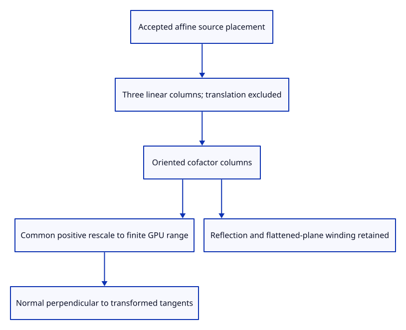

# 41a · Transform normals with nonuniform surface placement

**Typing: 9–18 minutes.** [Estimate](typing-load.md).

Build the normal matrix from cofactors of the placement’s three linear columns. Translation is excluded. A shared positive rescale keeps GPU entries finite without changing direction.

## Type

Continue from [Retain checked source normals beside display positions](41-normals.md). [Save or recover your work](recovery.md).

### 1. `src/normals.rs`

Prepare bounded cofactor columns for oriented affine normal transformation.

<details>
<summary>Locate the existing block</summary>

```rust
    Ok(vector.map(|v| v / length))
}
```

</details>

Replace that block with:

```rust
--8<-- "journey/code/41a-placement-01.rs"
```

### 2. `src/lib.rs`

Register nonuniform, reflected and singular placement checks.

<details>
<summary>Locate the existing block</summary>

```rust
pub mod normals;
```

</details>

Replace that block with:

```rust
--8<-- "journey/code/41a-placement-02.rs"
```

### 3. `src/normal_matrix_tests.rs`

Copy perpendicularity, translation independence, winding, collapse and finite-range checks.

Copy this check file:

```rust
--8<-- "journey/code/41a-placement-03.rs"
```

## Run and check

In your project:

```sh
cd workspace/journey
REGEN_PROTO=0 cargo build --lib --locked --target wasm32-unknown-unknown -j4
REGEN_PROTO=0 CARGO_BUILD_JOBS=4 trunk serve --port 8780
```

Open `http://127.0.0.1:8780/`. Keep an existing Trunk server running; saving rebuilds it.

Run perpendicularity, reflection, flattening and extreme-scale tests. Translation does not change the normal matrix.

**Verified checkpoint in Chrome.**


[Verification scope](release.md).

Run the state checks on your computer from your project folder:

```sh
REGEN_PROTO=0 cargo test --lib --locked --target host-tuple -j4
```

<details>
<summary>Code explanation and diagram</summary>

This follows oriented face winding under reflection and still works for a flattened plane. Rank-one collapse produces zero normals, preserving the flat fallback rather than pretending an inverse exists.

accepted affine placement → cofactor columns → bounded common scale → oriented world-normal matrix.



Why does multiplying a normal by the position matrix fail under nonuniform scale?

A normal must remain perpendicular to transformed tangent vectors. Cofactor columns preserve that relationship and face orientation, including reflections and rank-two flattening.

Study estimate, including typing and experiments: 0.75–1.25 hours.

</details>

<details>
<summary>Optional experiment</summary>

Shear and scale two source tangents differently. Their transformed cross product must align with the transformed source normal.

</details>

<details>
<summary>Check and save your work</summary>

Restore experimental edits, then run from `session_viewer`:

```sh
npm --prefix ../session_tests run course -- check 41a-placement
npm --prefix ../session_tests run course -- save 41a-placement
```

Source comparison leaves your project untouched. [Save and recovery instructions](recovery.md).

</details>

<details>
<summary>Viewer coverage and verification</summary>

Normal placement preparation is complete. GPU settings and smooth/flat drawing follow next; original source normals remain unchanged.

Native tests verify perpendicular transformed tangents, translation independence, oriented reflection, rank-two/rank-one collapse, huge finite scale and invalid affine refusal.

Actual Chrome draws two adjacent source faces with separate red and blue colours.

[Full validation scope](release.md).

To reproduce the scripted acceptance of the reference checkpoint, run from `session_viewer` with the [course bundle server](release.md#reproduce) running on port 8781:

```sh
npm --prefix ../session_tests run course -- capture 41a-placement
```

This uses the verified reference bundle; it does not check or change your typed project.

</details>
