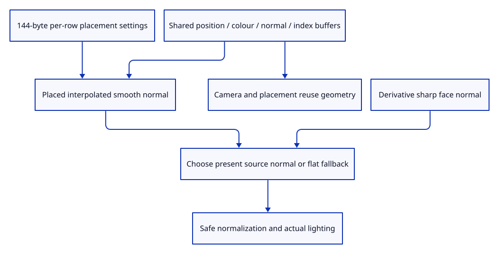

# 41b · Draw smooth normals and sharp surface faces

**Typing: 24–48 minutes.** [Estimate](typing-load.md).

Add one shared normal buffer beside positions and colours. Give each object a bounded cofactor matrix in its placement uniform; translation cannot change its normal direction.

## Type

Continue from [Transform normals with nonuniform surface placement](41a-placement.md). [Save or recover your work](recovery.md).

### 1. `src/gpu_geometry.rs`

Share the checked normal stream with the geometry’s existing GPU lifetime.

<details>
<summary>Locate the existing block</summary>

```rust
    vertices: wgpu::Buffer,
```

</details>

Replace that block with:

```rust
--8<-- "journey/code/41b-drawing-01.rs"
```

### 2. `src/gpu_geometry.rs`

Upload three finite floats for each display vertex normal.

<details>
<summary>Locate the existing block</summary>

```rust
        let bytes: Vec<u8> = source.indices().iter()
```

</details>

Replace that block with:

```rust
--8<-- "journey/code/41b-drawing-02.rs"
```

### 3. `src/gpu_geometry.rs`

Retain the normal allocation beside position and index buffers.

<details>
<summary>Locate the existing block</summary>

```rust
Self { source, vertices, indices, index_count }
```

</details>

Replace that block with:

```rust
--8<-- "journey/code/41b-drawing-03.rs"
```

### 4. `src/gpu_geometry.rs`

Report actual normal allocation bytes as shared geometry.

<details>
<summary>Locate the existing block</summary>

```rust
self.vertices.size() + self.indices.size()
```

</details>

Replace that block with:

```rust
--8<-- "journey/code/41b-drawing-04.rs"
```

### 5. `src/gpu_geometry.rs`

Bind the normal stream independently from position and colour attributes.

<details>
<summary>Locate the existing block</summary>

```rust
        pass.set_vertex_buffer(0, self.vertices.slice(..));
```

</details>

Replace that block with:

```rust
--8<-- "journey/code/41b-drawing-05.rs"
```

### 6. `src/renderer.rs`

Describe three normal floats in shader attribute two.

<details>
<summary>Locate the existing block</summary>

```rust
                    attributes: &wgpu::vertex_attr_array![0 => Float32x3, 1 => Float32x3],
                }],
```

</details>

Replace that block with:

```rust
--8<-- "journey/code/41b-drawing-06.rs"
```

### 7. `src/gpu_mesh.rs`

Retain previous model, selection and normal-matrix settings for change-only writes.

<details>
<summary>Locate the existing block</summary>

```rust
    previous: [u8; 80],
```

</details>

Replace that block with:

```rust
--8<-- "journey/code/41b-drawing-07.rs"
```

### 8. `src/gpu_mesh.rs`

Allocate 64 model bytes, 16 selection bytes and 64 normal-matrix bytes.

<details>
<summary>Locate the existing block</summary>

```rust
fn settings(object: &Object, selected: bool) -> [u8; 80] {
    let mut bytes = [0; 80];
```

</details>

Replace that block with:

```rust
--8<-- "journey/code/41b-drawing-08.rs"
```

### 9. `src/gpu_mesh.rs`

Serialize bounded normal cofactors after model and selection settings.

<details>
<summary>Locate the existing block</summary>

```rust
    bytes[64..68].copy_from_slice(&flag.to_ne_bytes());
    bytes
```

</details>

Replace that block with:

```rust
--8<-- "journey/code/41b-drawing-09.rs"
```

### 10. `src/gpu_mesh.rs`

Rewrite only the settings region whose bytes changed.

<details>
<summary>Locate the existing block</summary>

```rust
for (start, end) in [(0, 64), (64, 80)]
```

</details>

Replace that block with:

```rust
--8<-- "journey/code/41b-drawing-10.rs"
```

### 11. `src/scene.rs`

Refuse invalid initial placement before consuming an ID or creating a row.

<details>
<summary>Locate the existing block</summary>

```rust
    pub fn insert(&mut self, prepared: PreparedMesh) -> Result<ObjectId, &'static str> {
        let next
```

</details>

Replace that block with:

```rust
--8<-- "journey/code/41b-drawing-11.rs"
```

### 12. `src/geometry_cache.rs`

Count initialized normal payload separately from retained GPU capacity.

<details>
<summary>Locate the existing block</summary>

```rust
source.vertices().len() * 24 + source.indices().len() * 4
```

</details>

Replace that block with:

```rust
--8<-- "journey/code/41b-drawing-12.rs"
```

### 13. `src/renderer.rs`

Count complete initial object settings without confusing the separate ink view uniform.

<details>
<summary>Locate the existing block</summary>

```rust
self.settings_allocations as u64 * 80
```

</details>

Replace that block with:

```rust
--8<-- "journey/code/41b-drawing-13.rs"
```

### 14. `src/triangle.wgsl`

Keep the shader uniform layout identical to the 144-byte host settings.

<details>
<summary>Locate the existing block</summary>

```wgsl
    selection: vec4<f32>,
```

</details>

Replace that block with:

```wgsl
--8<-- "journey/code/41b-drawing-14.rs"
```

### 15. `src/triangle.wgsl`

Interpolate the placed source normal across the rasterized face.

<details>
<summary>Locate the existing block</summary>

```wgsl
    @location(1) world: vec3<f32>,
```

</details>

Replace that block with:

```wgsl
--8<-- "journey/code/41b-drawing-15.rs"
```

### 16. `src/triangle.wgsl`

Read the normal attribute from the separate shared stream.

<details>
<summary>Locate the existing block</summary>

```wgsl
fn vertex(@location(0) position: vec3<f32>, @location(1) colour: vec3<f32>) -> VertexOutput {
```

</details>

Replace that block with:

```wgsl
--8<-- "journey/code/41b-drawing-16.rs"
```

### 17. `src/triangle.wgsl`

Transform a direction without adding the object’s translation.

<details>
<summary>Locate the existing block</summary>

```wgsl
    output.world = world.xyz;
```

</details>

Replace that block with:

```wgsl
--8<-- "journey/code/41b-drawing-17.rs"
```

### 18. `src/triangle.wgsl`

Choose source smoothing or sharp derivatives, then normalize without zero division or squaring huge vectors.

<details>
<summary>Locate the existing block</summary>

```wgsl
    // Neighbouring fragments give two directions along this triangle's surface.
    let normal = normalize(cross(dpdx(input.world), dpdy(input.world)));
```

</details>

Replace that block with:

```wgsl
--8<-- "journey/code/41b-drawing-18.rs"
```

### 19. `src/lib.rs`

Register atomic placement and normal-stream GPU boundary checks.

<details>
<summary>Locate the existing block</summary>

```rust
pub mod normals;
```

</details>

Replace that block with:

```rust
--8<-- "journey/code/41b-drawing-19.rs"
```

### 20. `src/normal_gpu_tests.rs`

Copy invalid-placement refusal and unchanged identity-allocation checks.

Copy this check file:

```rust
--8<-- "journey/code/41b-drawing-20.rs"
```

## Run and check

In your project:

```sh
cd workspace/journey
REGEN_PROTO=0 cargo build --lib --locked --target wasm32-unknown-unknown -j4
REGEN_PROTO=0 CARGO_BUILD_JOBS=4 trunk serve --port 8780
```

Open `http://127.0.0.1:8780/`. Keep an existing Trunk server running; saving rebuilds it.

Render flat and smooth source faces. Smooth directions change the actual pixels; absent normals retain sharp faces, and placements change normal settings without uploading geometry.

**Verified checkpoint in Chrome.**


[Verification scope](release.md).

Run the state checks on your computer from your project folder:

```sh
REGEN_PROTO=0 cargo test --lib --locked --target host-tuple -j4
```

<details>
<summary>Code explanation and diagram</summary>

Interpolate present normals across the face, normalize safely in the fragment shader, and use the derivative face normal for explicit zero normals. Count actual normal allocations and initialized bytes separately from later uniform changes.

checked source normals → shared GPU normal buffer → per-row cofactor uniform → interpolated world direction or derivative face normal.



Why calculate the flat derivative normal even when a smooth normal is present?

Fragment derivatives need neighbouring invocations. Calculate them before choosing the normal, then safely normalize the selected finite direction without a zero-vector division.

Study estimate, including typing and experiments: 0.75–1.25 hours.

</details>

<details>
<summary>Optional experiment</summary>

Translate a mesh, then shear it. Translation rewrites position settings only; shear also rewrites the normal matrix while all shared geometry buffers remain unchanged.

</details>

<details>
<summary>Check and save your work</summary>

Restore experimental edits, then run from `session_viewer`:

```sh
npm --prefix ../session_tests run course -- check 41b-drawing
npm --prefix ../session_tests run course -- save 41b-drawing
```

Source comparison leaves your project untouched. [Save and recovery instructions](recovery.md).

</details>

<details>
<summary>Viewer coverage and verification</summary>

The actual renderer now uses source normals and correct affine normal placement. Normal examples, winding inspection and actual command/history/browser checks follow next.

Actual native renderer pixels check smooth interpolation, flat fallback and nonuniform/sheared/reflected/flattened placement. Resource checks prove shared buffer sizes, exact writes, no camera/placement geometry uploads and final Close release.

Actual Chrome draws two adjacent source faces with separate red and blue colours.

[Full validation scope](release.md).

To reproduce the scripted acceptance of the reference checkpoint, run from `session_viewer` with the [course bundle server](release.md#reproduce) running on port 8781:

```sh
npm --prefix ../session_tests run course -- capture 41b-drawing
```

This uses the verified reference bundle; it does not check or change your typed project.

</details>
