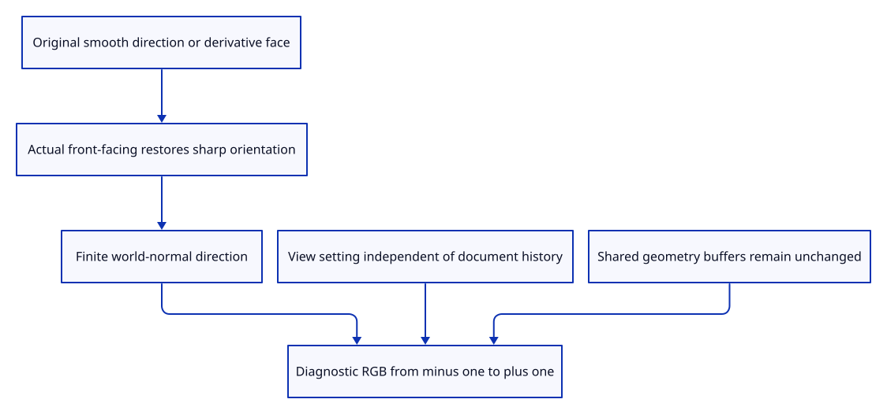

# 41c · Reveal oriented world normals in the renderer

**Typing: 29–58 minutes.** [Estimate](typing-load.md).

Recover oriented sharp-face directions from derivatives and the actual front-facing flag. Present original smooth directions or sharp fallback as world-normal RGB.

## Type

Continue from [Draw smooth normals and sharp surface faces](41b-drawing.md). [Save or recover your work](recovery.md).

### 1. `src/normal_example.rs`

Create original source specimens with missing, smooth or oppositely wound normals.

Create the file and type:

```rust
--8<-- "journey/code/41c-view-01.rs"
```

### 2. `src/lib.rs`

Register actual normal specimens and source/history checks.

<details>
<summary>Locate the existing block</summary>

```rust
pub mod normals;
```

</details>

Replace that block with:

```rust
--8<-- "journey/code/41c-view-02.rs"
```

### 3. `src/editor.rs`

Expose source insertion and normal diagnostics as separate editor actions.

<details>
<summary>Locate the existing block</summary>

```rust
    AddColours(crate::colour::Mode),
```

</details>

Replace that block with:

```rust
--8<-- "journey/code/41c-view-03.rs"
```

### 4. `src/editor.rs`

Retain the diagnostic view outside source document history.

<details>
<summary>Locate the existing block</summary>

```rust
    pub background: Background,
```

</details>

Replace that block with:

```rust
--8<-- "journey/code/41c-view-04.rs"
```

### 5. `src/editor.rs`

Start with ordinary surface lighting.

<details>
<summary>Locate the existing block</summary>

```rust
            background: Background::default(),
```

</details>

Replace that block with:

```rust
--8<-- "journey/code/41c-view-05.rs"
```

### 6. `src/editor.rs`

Change normal visualization without adding document history.

<details>
<summary>Locate the existing block</summary>

```rust
                    Action::Background => self.background.toggle(),
```

</details>

Replace that block with:

```rust
--8<-- "journey/code/41c-view-06.rs"
```

### 7. `src/triangle.wgsl`

Describe camera transform and diagnostic mode in the view uniform.

<details>
<summary>Locate the existing block</summary>

```wgsl
@group(0) @binding(0) var<uniform> transform: mat4x4<f32>;
```

</details>

Replace that block with:

```wgsl
--8<-- "journey/code/41c-view-07.rs"
```

### 8. `src/triangle.wgsl`

Use the transform field of the extended view settings.

<details>
<summary>Locate the existing block</summary>

```wgsl
output.position = transform * world;
```

</details>

Replace that block with:

```wgsl
--8<-- "journey/code/41c-view-08.rs"
```

### 9. `src/triangle.wgsl`

Receive actual face orientation rather than inferring winding from lighting.

<details>
<summary>Locate the existing block</summary>

```wgsl
fn fragment(input: VertexOutput) -> @location(0) vec4<f32> {
```

</details>

Replace that block with:

```wgsl
--8<-- "journey/code/41c-view-09.rs"
```

### 10. `src/triangle.wgsl`

Recover oriented sharp-face normals from raster derivatives and actual front-facing state.

<details>
<summary>Locate the existing block</summary>

```wgsl
    let face = cross(dpdx(input.world), dpdy(input.world));
```

</details>

Replace that block with:

```wgsl
--8<-- "journey/code/41c-view-10.rs"
```

### 11. `src/triangle.wgsl`

Map oriented world-normal components into visible diagnostic RGB.

<details>
<summary>Locate the existing block</summary>

```wgsl
    let light = normalize(vec3<f32>(0.4, -0.6, 1.0));
```

</details>

Replace that block with:

```wgsl
--8<-- "journey/code/41c-view-11.rs"
```

### 12. `src/renderer.rs`

Allocate the complete camera and diagnostic uniform.

<details>
<summary>Locate the existing block</summary>

```rust
            label: Some("view transform"),
            size: 64,
```

</details>

Replace that block with:

```rust
--8<-- "journey/code/41c-view-12.rs"
```

### 13. `src/renderer.rs`

Draw either actual surface lighting or normal diagnostics with shared geometry and ink.

<details>
<summary>Locate the existing block</summary>

```rust
    ) {
        let bytes: Vec<u8> = transform.iter().flat_map(|value| value.to_ne_bytes()).collect();
        self.queue.write_buffer(&self.uniform, 0, &bytes);
```

</details>

Replace that block with:

```rust
--8<-- "journey/code/41c-view-13.rs"
```

### 14. `src/browser.rs`

Pass the editor’s diagnostic setting to actual initial or subsequent browser drawing.

<details>
<summary>Locate the existing block</summary>

```rust
            &editor.camera.uniform(),
            &mut panel,
```

</details>

Replace that block with:

```rust
--8<-- "journey/code/41c-view-14.rs"
```

### 15. `src/browser.rs`

Pass the editor’s diagnostic setting to actual initial or subsequent browser drawing.

<details>
<summary>Locate the existing block</summary>

```rust
                &editor.camera.uniform(),
                &mut panel,
```

</details>

Replace that block with:

```rust
--8<-- "journey/code/41c-view-15.rs"
```

### 16. `src/browser.rs`

Carry diagnostic mode through browser surface presentation.

<details>
<summary>Locate the existing block</summary>

```rust
    transform: &[f32; 16],
    panel: &mut crate::panel::Panel,
```

</details>

Replace that block with:

```rust
--8<-- "journey/code/41c-view-16.rs"
```

### 17. `src/browser.rs`

Present actual diagnostic pixels through the maintained surface renderer.

<details>
<summary>Locate the existing block</summary>

```rust
    renderer.draw(&view, background, transform);
```

</details>

Replace that block with:

```rust
--8<-- "journey/code/41c-view-17.rs"
```

### 18. `src/browser.rs`

Expose current view mode for actual command verification.

<details>
<summary>Locate the existing block</summary>

```rust
    canvas.set_attribute("data-camera-matrix",
```

</details>

Replace that block with:

```rust
--8<-- "journey/code/41c-view-18.rs"
```

## Run and check

In your project:

```sh
cd workspace/journey
REGEN_PROTO=0 cargo build --lib --locked --target wasm32-unknown-unknown -j4
REGEN_PROTO=0 CARGO_BUILD_JOBS=4 trunk serve --port 8780
```

Open `http://127.0.0.1:8780/`. Keep an existing Trunk server running; saving rebuilds it.

Run actual native diagnostic pixels for sharp, smooth and oppositely wound faces in both projections and densities.

**Verified checkpoint in Chrome.**


[Verification scope](release.md).

Run the state checks on your computer from your project folder:

```sh
REGEN_PROTO=0 cargo test --lib --locked --target host-tuple -j4
```

<details>
<summary>Code explanation and diagram</summary>

Extend camera settings independently from object placement. Keep normal visualization outside document history and reuse all geometry buffers.

The winding specimen uses independent panels. The kernel decoder repairs inconsistent shared-edge winding, so it would otherwise erase the intentional contrast on reopen.

source normals or sharp derivatives → actual front-facing orientation → world-normal RGB → view-only camera settings.



Why do derivatives alone fail to distinguish opposite source face winding?

They follow neighbouring rasterized points, so reversed vertex order produces the same screen derivatives. The actual front-facing flag restores oriented sharp-face normals.

Study estimate, including typing and experiments: 0.75–1.25 hours.

</details>

<details>
<summary>Optional experiment</summary>

Reverse one face order. Its normal-view blue component changes from one to zero while ordinary double-sided lighting remains readable.

</details>

<details>
<summary>Check and save your work</summary>

Restore experimental edits, then run from `session_viewer`:

```sh
npm --prefix ../session_tests run course -- check 41c-view
npm --prefix ../session_tests run course -- save 41c-view
```

Source comparison leaves your project untouched. [Save and recovery instructions](recovery.md).

</details>

<details>
<summary>Viewer coverage and verification</summary>

Actual diagnostic rendering, view state and native oriented pixels are complete. Dock commands, source history and editable roundtrips follow next.

Actual native GPU pixels verify sharp, smooth and reversed winding in both projections at DPR1/2. Existing real colour input remains the Chrome baseline until the diagnostic commands next.

Actual Chrome draws two adjacent source faces with separate red and blue colours.

[Full validation scope](release.md).

To reproduce the scripted acceptance of the reference checkpoint, run from `session_viewer` with the [course bundle server](release.md#reproduce) running on port 8781:

```sh
npm --prefix ../session_tests run course -- capture 41c-view
```

This uses the verified reference bundle; it does not check or change your typed project.

</details>
