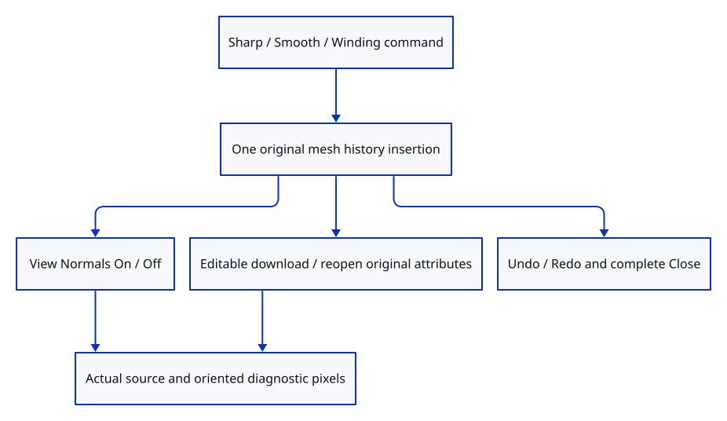

# 41ca · Inspect smooth normals and face winding through commands

**Typing: 11–22 minutes.** [Estimate](typing-load.md).

Insert original sharp, smooth and oppositely wound surfaces through dock commands. View Normals On maps world-normal components from minus one through plus one into visible RGB.

## Type

Continue from [Reveal oriented world normals in the renderer](41c-view.md). [Save or recover your work](recovery.md).

### 1. `src/editor.rs`

Expose source insertion and normal diagnostics as separate editor actions.

<details>
<summary>Locate the existing block</summary>

```rust
    NormalView(bool),
```

</details>

Replace that block with:

```rust
--8<-- "journey/code/41ca-input-01.rs"
```

### 2. `src/editor.rs`

Commit one original normal specimen in a single undoable insertion.

<details>
<summary>Locate the existing block</summary>

```rust
            Action::AddColours(mode) => {
```

</details>

Replace that block with:

```rust
--8<-- "journey/code/41ca-input-02.rs"
```

### 3. `src/browser.rs`

Expose normal specimens and diagnostics in actual dock completion and Help.

<details>
<summary>Locate the existing block</summary>

```rust
            "Example Face Colors",
```

</details>

Replace that block with:

```rust
--8<-- "journey/code/41ca-input-03.rs"
```

### 4. `src/browser.rs`

Dispatch real command input through source and view actions.

<details>
<summary>Locate the existing block</summary>

```rust
                    "example face colors" => Action::AddColours(crate::colour::Mode::Faces),
```

</details>

Replace that block with:

```rust
--8<-- "journey/code/41ca-input-04.rs"
```

### 5. `src/lib.rs`

Register source normal attributes, view independence, history and editable roundtrip checks.

<details>
<summary>Locate the existing block</summary>

```rust
pub mod normal_example;
```

</details>

Replace that block with:

```rust
--8<-- "journey/code/41ca-input-06.rs"
```

### 6. `src/normal_input_tests.rs`

Copy source normal attributes, exact protobuf roundtrip, independent view mode, one-step history and Close checks.

Copy this check file:

```rust
--8<-- "journey/code/41ca-input-05.rs"
```

## Run and check

In your project:

```sh
cd workspace/journey
REGEN_PROTO=0 cargo build --lib --locked --target wasm32-unknown-unknown -j4
REGEN_PROTO=0 CARGO_BUILD_JOBS=4 trunk serve --port 8780
```

Open `http://127.0.0.1:8780/`. Keep an existing Trunk server running; saving rebuilds it.

Close, type Example Winding, then View Normals On. The neighbouring source faces show opposite blue components; View Normals Off restores surface lighting.

**Verified checkpoint in Chrome.**


[Verification scope](release.md).

Run the state checks on your computer from your project folder:

```sh
REGEN_PROTO=0 cargo test --lib --locked --target host-tuple -j4
```

<details>
<summary>Code explanation and diagram</summary>

Recover oriented sharp-face normals using the actual front-facing flag. Keep this view setting outside document history; Save/reopen preserves original normal attributes rather than diagnostic pixel colours.

Keep the oppositely wound panels topologically independent: the kernel’s load policy repairs inconsistent winding across a shared edge.

sharp / smooth / winding specimen command → one original mesh insertion → View Normals diagnostic → actual direction pixels → source Save / reopen.



Why does a normals view need the front-facing flag for a sharp face?

Screen-space derivatives describe the same rasterized surface even when its vertex order reverses. The front-facing flag recovers the oriented face direction, so reversed winding becomes visible.

Study estimate, including typing and experiments: 0.75–1.25 hours.

</details>

<details>
<summary>Optional experiment</summary>

Compare Example Sharp and Example Smooth using View Normals On. The sharp face stays one direction; the smooth face interpolates its original vertex directions.

</details>

<details>
<summary>Check and save your work</summary>

Restore experimental edits, then run from `session_viewer`:

```sh
npm --prefix ../session_tests run course -- check 41ca-input
npm --prefix ../session_tests run course -- save 41ca-input
```

Source comparison leaves your project untouched. [Save and recovery instructions](recovery.md).

</details>

<details>
<summary>Viewer coverage and verification</summary>

Original smooth/flat input, oriented winding diagnostics, history and normal-attribute save/reopen are complete. Full visual styles remain in91; the depth-correct grid follows next.

Native source/history/protobuf checks and actual GPU direction pixels verify flat, smooth and reversed faces. Chrome compares diagnostics at DPR1/2 in both projections, buffer reuse, one-step Undo/Redo, downloaded-file reopening and Close.

Actual Chrome normals view distinguishes two independent source panels with opposite winding.

[Full validation scope](release.md).

To reproduce the scripted acceptance of the reference checkpoint, run from `session_viewer` with the [course bundle server](release.md#reproduce) running on port 8781:

```sh
npm --prefix ../session_tests run course -- capture 41ca-input
```

This uses the verified reference bundle; it does not check or change your typed project.

</details>
