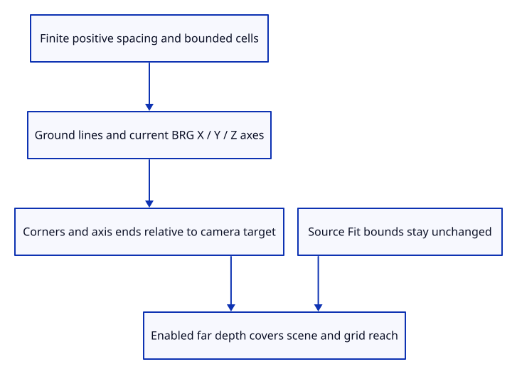

# 41d · Bound the ground grid and its camera depth range

**Typing: 26–52 minutes.** [Estimate](typing-load.md).

Build finite floor lines and the current pink, yellow-green and blue axes. Validate spacing and cap the number of cells before allocating display data.

## Type

Continue from [Inspect smooth normals and face winding through commands](41ca-input.md). [Save or recover your work](recovery.md).

### 1. `src/grid.rs`

Validate and prepare finite grid lines, current axis colours and depth-reach reference points.

Create the file and type:

```rust
--8<-- "journey/code/41d-grid-01.rs"
```

### 2. `src/lib.rs`

Register bounded ground-grid preparation and camera-range checks.

<details>
<summary>Locate the existing block</summary>

```rust
pub mod normal_example;
```

</details>

Replace that block with:

```rust
--8<-- "journey/code/41d-grid-02.rs"
```

### 3. `src/camera.rs`

Retain the enabled grid extent independently of source scene bounds.

<details>
<summary>Locate the existing block</summary>

```rust
    pub projection: Projection,
```

</details>

Replace that block with:

```rust
--8<-- "journey/code/41d-grid-03.rs"
```

### 4. `src/camera.rs`

Keep prior camera drawing unchanged until actual grid input enables it.

<details>
<summary>Locate the existing block</summary>

```rust
            projection: Projection::Perspective,
```

</details>

Replace that block with:

```rust
--8<-- "journey/code/41d-grid-04.rs"
```

### 5. `src/camera.rs`

Include grid corners in enabled far depth without altering source Fit bounds.

<details>
<summary>Locate the existing block</summary>

```rust
        let far = self.distance + self.radius * 2.0;
```

</details>

Replace that block with:

```rust
--8<-- "journey/code/41d-grid-05.rs"
```

### 6. `src/grid_source_tests.rs`

Copy checked grid capacity, source colour values, invalid input and actual camera corner-depth checks.

Copy this check file:

```rust
--8<-- "journey/code/41d-grid-06.rs"
```

## Run and check

In your project:

```sh
cd workspace/journey
REGEN_PROTO=0 cargo build --lib --locked --target wasm32-unknown-unknown -j4
REGEN_PROTO=0 CARGO_BUILD_JOBS=4 trunk serve --port 8780
```

Open `http://127.0.0.1:8780/`. Keep an existing Trunk server running; saving rebuilds it.

Run bounded-grid and depth-range checks. Grid data has a fixed checked maximum, current axis colours and camera reach that includes its distant corners.

**Verified checkpoint in Chrome.**


[Verification scope](release.md).

Run the state checks on your computer from your project folder:

```sh
REGEN_PROTO=0 cargo test --lib --locked --target host-tuple -j4
```

<details>
<summary>Code explanation and diagram</summary>

Include grid corners and axis ends in camera depth reach when enabled. Keep Fit tied to source geometry; extending the depth range does not enlarge the source object.

checked spacing and bounded cell count → finite floor lines and BRG axes → corner/axis depth reach → camera far range.



Why can fitting a small object accidentally clip a large ground grid?

The scene radius only covers the object. The far depth range must also reach the grid corners relative to the camera target, without changing the object’s Fit bounds.

Study estimate, including typing and experiments: 0.75–1.25 hours.

</details>

<details>
<summary>Optional experiment</summary>

Fit a small scene and orbit into an isometric view. Compare a distant grid corner’s depth with the grid disabled and enabled.

</details>

<details>
<summary>Check and save your work</summary>

Restore experimental edits, then run from `session_viewer`:

```sh
npm --prefix ../session_tests run course -- check 41d-grid
npm --prefix ../session_tests run course -- save 41d-grid
```

Source comparison leaves your project untouched. [Save and recovery instructions](recovery.md).

</details>

<details>
<summary>Viewer coverage and verification</summary>

Checked grid preparation and camera range are complete. Actual GPU grid drawing and real grid input follow; defaults use metre-sized course units for the same physical5m half-width as production5000mm.

Native tests verify exact bounded line counts, finite coordinates, axis colours, invalid-spacing/range refusal and actual projected corner depth after small-scene Fit. Actual normal-input Chrome remains the browser baseline.

Actual Chrome normals view distinguishes two source faces with opposite winding.

[Full validation scope](release.md).

To reproduce the scripted acceptance of the reference checkpoint, run from `session_viewer` with the [course bundle server](release.md#reproduce) running on port 8781:

```sh
npm --prefix ../session_tests run course -- capture 41d-grid
```

This uses the verified reference bundle; it does not check or change your typed project.

</details>
