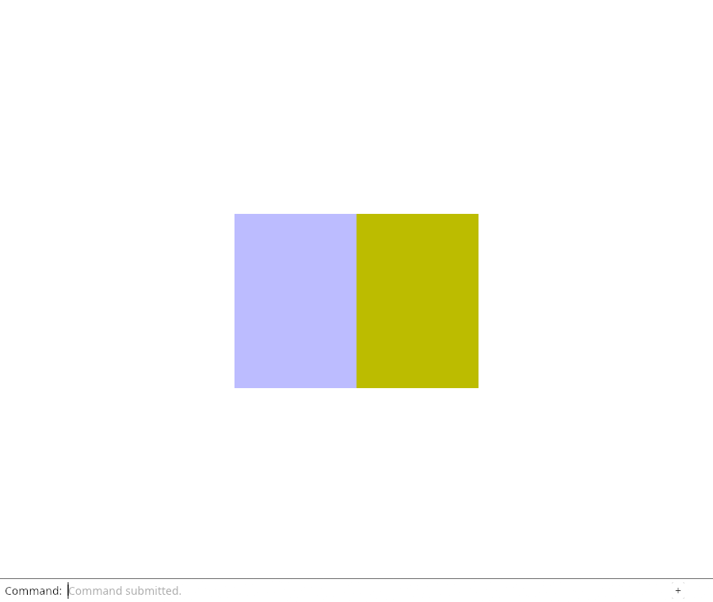
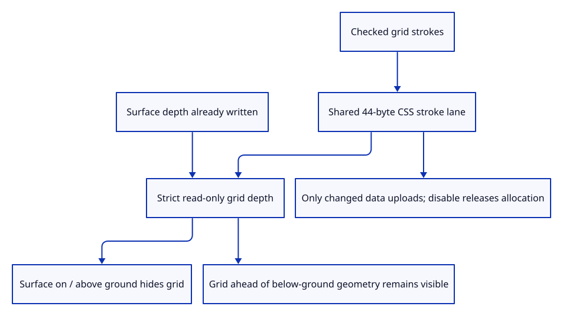

# 41e · Draw a depth-correct grid with shared stroke buffers

**Typing: 20–40 minutes.** [Estimate](typing-load.md).

Reuse the existing CSS stroke lane for the finite grid and axes. Give its pipeline strict read-only surface depth; draw it after surfaces and before source ink.

## Type

Continue from [Bound the ground grid and its camera depth range](41d-grid.md). [Save or recover your work](recovery.md).

### 1. `src/depth.rs`

Hide coplanar grid ink without changing source strokes’ equal-depth drawing policy.

<details>
<summary>Locate the existing block</summary>

```rust
pub fn ink() -> wgpu::DepthStencilState { state(false, wgpu::CompareFunction::LessEqual) }
```

</details>

Replace that block with:

```rust
--8<-- "journey/code/41e-drawing-01.rs"
```

### 2. `src/stroke_gpu.rs`

Share stroke preparation while choosing a separate grid depth policy.

<details>
<summary>Locate the existing block</summary>

```rust
        let shader = device.create_shader_module(wgpu::ShaderModuleDescriptor {
            label: Some("stroke"),
```

</details>

Replace that block with:

```rust
--8<-- "journey/code/41e-drawing-02.rs"
```

### 3. `src/stroke_gpu.rs`

Use the caller’s explicit ink or grid depth policy.

<details>
<summary>Locate the existing block</summary>

```rust
depth_stencil: Some(crate::depth::ink()),
```

</details>

Replace that block with:

```rust
--8<-- "journey/code/41e-drawing-03.rs"
```

### 4. `src/renderer.rs`

Own grid display data independently from document geometry.

<details>
<summary>Locate the existing block</summary>

```rust
    markers: crate::stroke_gpu::Lane,
```

</details>

Replace that block with:

```rust
--8<-- "journey/code/41e-drawing-04.rs"
```

### 5. `src/renderer.rs`

Create an empty depth-correct grid pipeline.

<details>
<summary>Locate the existing block</summary>

```rust
        let markers = crate::stroke_gpu::Lane::markers(&device, format);
```

</details>

Replace that block with:

```rust
--8<-- "journey/code/41e-drawing-05.rs"
```

### 6. `src/renderer.rs`

Retain the grid lane for the renderer lifetime.

<details>
<summary>Locate the existing block</summary>

```rust
uniform, view_group, depth, strokes, paths, markers, size:
```

</details>

Replace that block with:

```rust
--8<-- "journey/code/41e-drawing-06.rs"
```

### 7. `src/renderer.rs`

Validate grid settings before mutation and expose actual grid bytes and uploads.

<details>
<summary>Locate the existing block</summary>

```rust
    pub fn stats(&self) -> [usize; 4] {
```

</details>

Replace that block with:

```rust
--8<-- "journey/code/41e-drawing-07.rs"
```

### 8. `src/renderer.rs`

Include initialized grid payload in cumulative uploads without mixing current allocations.

<details>
<summary>Locate the existing block</summary>

```rust
+ self.strokes.uploaded_bytes + self.paths.uploaded_bytes + self.markers.uploaded_bytes
```

</details>

Replace that block with:

```rust
--8<-- "journey/code/41e-drawing-08.rs"
```

### 9. `src/renderer.rs`

Update only grid view settings when the camera or display density changes.

<details>
<summary>Locate the existing block</summary>

```rust
        self.markers.view(&self.queue, transform, self.size, self.density);
```

</details>

Replace that block with:

```rust
--8<-- "journey/code/41e-drawing-09.rs"
```

### 10. `src/renderer.rs`

Draw the grid against actual surface depth before original source ink.

<details>
<summary>Locate the existing block</summary>

```rust
            self.strokes.draw(&mut pass);
```

</details>

Replace that block with:

```rust
--8<-- "journey/code/41e-drawing-10.rs"
```

## Run and check

In your project:

```sh
cd workspace/journey
REGEN_PROTO=0 cargo build --lib --locked --target wasm32-unknown-unknown -j4
REGEN_PROTO=0 CARGO_BUILD_JOBS=4 trunk serve --port 8780
```

Open `http://127.0.0.1:8780/`. Keep an existing Trunk server running; saving rebuilds it.

Run actual grid pixels, surface occlusion and buffer-reuse checks. Grid view changes reuse geometry; disabling releases the active grid allocation.

**Verified checkpoint in Chrome.**



[Verification scope](release.md).

Run the state checks on your computer from your project folder:

```sh
REGEN_PROTO=0 cargo test --lib --locked --target host-tuple -j4
```

<details>
<summary>Code explanation and diagram</summary>

Keep grid buffers independent from document ownership. Upload changed grid data only, count initialized payload separately from current capacity, and release the active allocation when disabled.

Cache accepted grid settings as well as packed bytes, so camera events do not rebuild identical grid data on the CPU.

checked grid strokes → shared 44-byte lane → read-only strict depth → actual floor/axis pixels → change-only buffer ownership.



Why does ground-grid ink use a strict depth comparison?

A source face on or above the ground hides the grid. Read-only Less keeps a coplanar grid from overlaying the face, while grid lines in front of below-ground geometry remain visible.

Study estimate, including typing and experiments: 0.75–1.25 hours.

</details>

<details>
<summary>Optional experiment</summary>

Place a surface above, on and below the ground. Grid lines must be hidden in the first two cases and visible where nearer in the last.

</details>

<details>
<summary>Check and save your work</summary>

Restore experimental edits, then run from `session_viewer`:

```sh
npm --prefix ../session_tests run course -- check 41e-drawing
npm --prefix ../session_tests run course -- save 41e-drawing
```

Source comparison leaves your project untouched. [Save and recovery instructions](recovery.md).

</details>

<details>
<summary>Viewer coverage and verification</summary>

Actual finite grid drawing, current axis colours and exact resources are complete. Commands and browser view-state acceptance follow next.

Actual native GPU checks verify BRG axis pixels, surface/grid ordering at three heights, both projections and DPR1/2. Buffer checks cover exact1100-byte default payload, view reuse, invalid-input atomicity and release; actual normal input remains the Chrome baseline.

Actual Chrome normals view distinguishes two source faces with opposite winding.

[Full validation scope](release.md).

To reproduce the scripted acceptance of the reference checkpoint, run from `session_viewer` with the [course bundle server](release.md#reproduce) running on port 8781:

```sh
npm --prefix ../session_tests run course -- capture 41e-drawing
```

This uses the verified reference bundle; it does not check or change your typed project.

</details>
