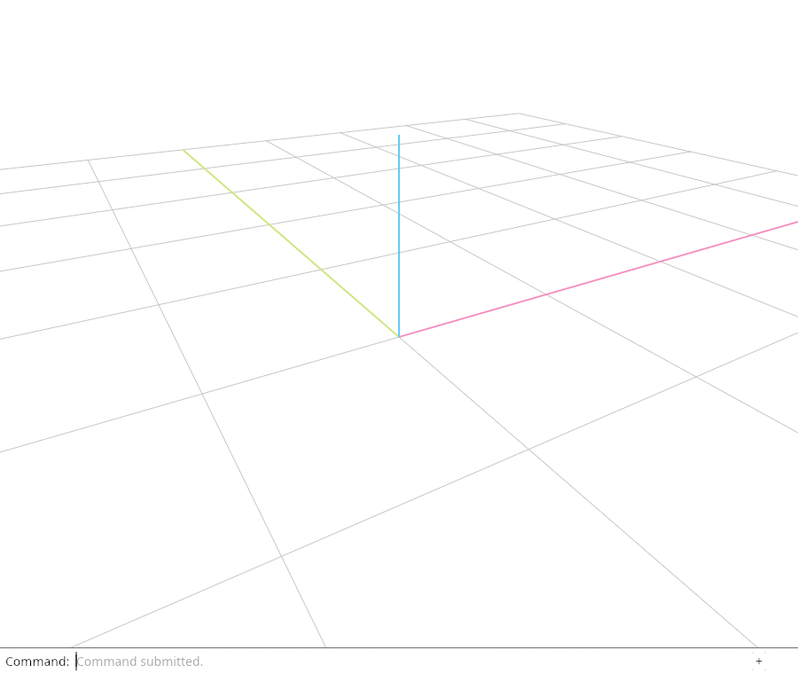
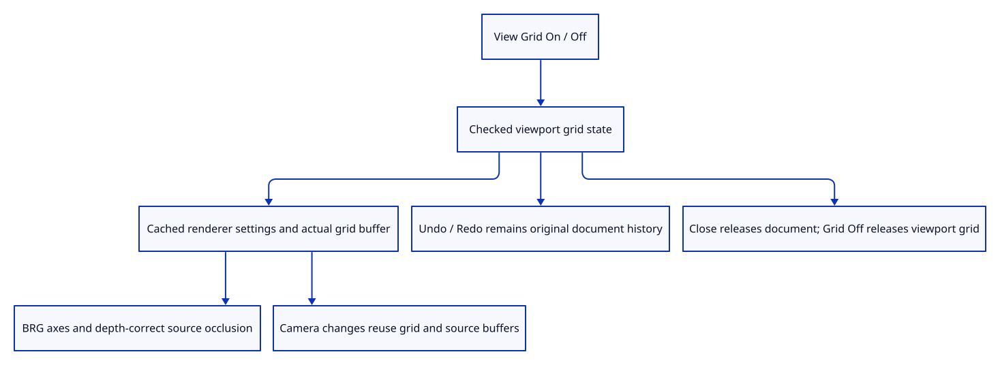

# 41f · Inspect the ground grid through actual commands

**Typing: 12–23 minutes.** [Estimate](typing-load.md).

Add View Grid On and View Grid Off as view actions. Validate settings before changing the camera; synchronize only changed grid settings before actual browser inspection and drawing.

## Type

Continue from [Draw a depth-correct grid with shared stroke buffers](41e-drawing.md). [Save or recover your work](recovery.md).

### 1. `src/editor.rs`

Expose checked viewport grid state through editor input.

<details>
<summary>Locate the existing block</summary>

```rust
    NormalView(bool),
```

</details>

Replace that block with:

```rust
--8<-- "journey/code/41f-input-01.rs"
```

### 2. `src/editor.rs`

Validate finite grid settings before changing viewport state.

<details>
<summary>Locate the existing block</summary>

```rust
                    Action::NormalView(visible) => self.normal_view = visible,
```

</details>

Replace that block with:

```rust
--8<-- "journey/code/41f-input-02.rs"
```

### 3. `src/editor.rs`

Reset camera pose while preserving the existing grid view setting.

<details>
<summary>Locate the existing block</summary>

```rust
self.camera = Camera { aspect, ..Camera::default() };
```

</details>

Replace that block with:

```rust
--8<-- "journey/code/41f-input-03.rs"
```

### 4. `src/browser.rs`

Expose actual grid input in dock completion and Help.

<details>
<summary>Locate the existing block</summary>

```rust
            "View Normals Off",
```

</details>

Replace that block with:

```rust
--8<-- "journey/code/41f-input-04.rs"
```

### 5. `src/browser.rs`

Dispatch real viewport grid commands through checked editor actions.

<details>
<summary>Locate the existing block</summary>

```rust
                    "view normals off" => Action::NormalView(false),
```

</details>

Replace that block with:

```rust
--8<-- "journey/code/41f-input-05.rs"
```

### 6. `src/browser.rs`

Synchronize cached grid state before reporting or presenting the actual frame.

<details>
<summary>Locate the existing block</summary>

```rust
        if let Err(error) = inspect(&editor, &renderer) {
```

</details>

Replace that block with:

```rust
--8<-- "journey/code/41f-input-06.rs"
```

### 7. `src/browser.rs`

Expose actual enabled state and grid allocation/upload counters.

<details>
<summary>Locate the existing block</summary>

```rust
    canvas.set_attribute("data-normal-view",
```

</details>

Replace that block with:

```rust
--8<-- "journey/code/41f-input-07.rs"
```

### 8. `src/lib.rs`

Register atomic grid state, camera reset and source-history checks.

<details>
<summary>Locate the existing block</summary>

```rust
pub mod grid;
```

</details>

Replace that block with:

```rust
--8<-- "journey/code/41f-input-08.rs"
```

### 9. `src/grid_input_tests.rs`

Copy validation atomicity, reset preservation, view-only history and independent source/grid release checks.

Copy this check file:

```rust
--8<-- "journey/code/41f-input-09.rs"
```

## Run and check

In your project:

```sh
cd workspace/journey
REGEN_PROTO=0 cargo build --lib --locked --target wasm32-unknown-unknown -j4
REGEN_PROTO=0 CARGO_BUILD_JOBS=4 trunk serve --port 8780
```

Open `http://127.0.0.1:8780/`. Keep an existing Trunk server running; saving rebuilds it.

Close, type View Grid On and View Isometric. Inspect pink X, yellow-green Y and blue Z axes; View Grid Off releases the grid allocation.

**Verified checkpoint in Chrome.**



[Verification scope](release.md).

Run the state checks on your computer from your project folder:

```sh
REGEN_PROTO=0 cargo test --lib --locked --target host-tuple -j4
```

<details>
<summary>Code explanation and diagram</summary>

Keep the grid through pose reset and document Close. Its allocation belongs to the viewport, so turning the grid off releases it independently from original scene geometry and history.

View Grid On / Off → validated camera grid setting → cached renderer grid lane → actual BRG pixels and source occlusion → view-only history.



What should View Reset and Close do to the ground grid?

View Reset changes the pose and preserves the grid setting. Close releases document geometry and history while the viewport grid remains; View Grid Off releases its active buffer.

Study estimate, including typing and experiments: 0.75–1.25 hours.

</details>

<details>
<summary>Optional experiment</summary>

Insert Example Sharp, toggle the grid and reset the view. One Undo still removes that source insertion; grid settings never enter document history.

</details>

<details>
<summary>Check and save your work</summary>

Restore experimental edits, then run from `session_viewer`:

```sh
npm --prefix ../session_tests run course -- check 41f-input
npm --prefix ../session_tests run course -- save 41f-input
```

Source comparison leaves your project untouched. [Save and recovery instructions](recovery.md).

</details>

<details>
<summary>Viewer coverage and verification</summary>

Finite grid input, current BRG colours, grid-aware far depth and viewport resource lifetimes are complete. Grid starts off in this teaching stage; production-style defaults and full visual modes are reconciled in91/94.

Native checks prove atomic grid validation, pose reset preservation and independent source history. Chrome measures actual BRG axes at DPR1/2 in both projections, coplanar source occlusion, camera buffer reuse, Undo/Redo, document Close and independent grid release.

Actual Chrome draws the finite ground grid and current pink, yellow-green and blue axes.

[Full validation scope](release.md).

To reproduce the scripted acceptance of the reference checkpoint, run from `session_viewer` with the [course bundle server](release.md#reproduce) running on port 8781:

```sh
npm --prefix ../session_tests run course -- capture 41f-input
```

This uses the verified reference bundle; it does not check or change your typed project.

</details>
