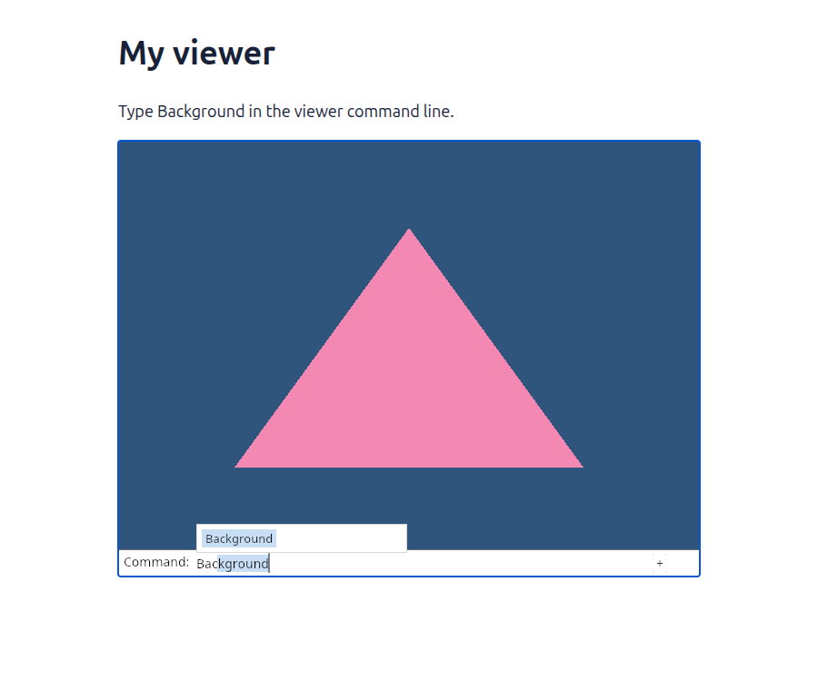
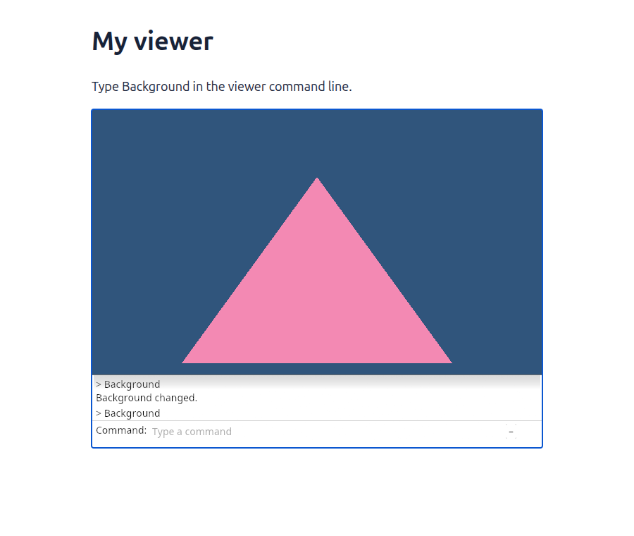

# Our command line, from the beginning

**Work in progress.** The real command dock now runs in the small triangle project. The typing lessons for this revision are not finished. The last published, browser-verified lesson is [24 · Find the whole scene](24-fit.md).

You were right to ask for the viewer's own command line. We should learn the interface we will actually use. The preview uses the production Rust/egui component: the same Noto fonts, white panel, caret, completion list and folding history.

[Open the working command-line preview](http://127.0.0.1:8781/real-dock/dist/). This local link needs the course server running. It is an integration check, not a replacement for typing the lessons.

## Follow one command

Type `Bac`. The dock suggests `Background`. Press Enter: the background changes, while the triangle stays where it was. Enter `Background` again to return to blue. Use `+` to see both commands and their answers.

`Background` is a practice command in this small project; it is not an existing production viewer command. Later commands will reach the camera, document and editing tools through the same submission route.


Think of the dock as a receptionist. It helps you write a request and keeps the answer. It does not change the geometry itself. The application receives the completed line, changes the relevant value, then asks for another picture.

| Part | Owns | Does not own |
| --- | --- | --- |
| Browser input | Keys, pointer positions and focus | Geometry or command meaning |
| Command dock | Edited text, suggestions and history | Camera and document state |
| Command vocabulary | Recognised words and options | Drawing the input field |
| Application | Applying a submitted command | Font layout |
| GPU painters | Geometry and egui triangles | Choosing which command to run |

## Two actual Chrome captures

The first capture shows `Bac` completed to `Background`, with the suggested suffix selected. This is the production completion widget rendered inside the course canvas.



The second capture shows the expanded history after two commands. It is a different interface state, not the same screenshot with another filename.



The browser check verifies completion, Enter, Escape and history expansion. It also compares every drawing pixel above the folded dock: two background changes must restore the original picture exactly. Separately, five production dock states were compared before and after extraction and matched pixel for pixel.

## What changes in the lessons

The early lessons will introduce the actual dock in small, runnable parts: drawing its panel and text; delivering keyboard input; submitting a command; then completion and history. You will type these parts, with a diagram showing who owns each value. A large unexplained module is not a finished lesson.

After that, subsequent lessons will test actions through commands and natural canvas gestures. Their screenshots and browser checks must be recaptured against the revised code. The existing button-based typing pages still describe the previous course revision; this preview does not mark them updated.

- [x] Extract the production dock and preserve its appearance.
- [x] Run it in the small project with real Chrome input.
- [ ] Finish the early typing lessons and their time estimates.
- [ ] Update the later lessons and rerun their browser checks.
- [ ] Finish lesson 25 and continue the [complete course plan](roadmap.md).
- [ ] Remove the old tutorials after the complete replacement is verified.

## Reproduce the preview

These are maintainer checks. They build under `target`; they do not write into your handwritten project.

From `session_viewer`:

```sh
npm --prefix ../session_tests run course -- dock-preview
npm --prefix ../session_tests run course -- serve 8781
```

Then, in another terminal from the same directory:

```sh
NODE_PATH="$PWD/target/course-tools/node_modules" node tests/course_command_dock.cjs
```

The browser check needs Playwright, pngjs and visible Google Chrome. The preview shares `src/command_dock` directly during assembly, so its interface cannot quietly drift into an HTML imitation. Its simple browser adapter still needs the later lessons on clipboard, composition, touch, focus loss and resource lifetimes; this check does not claim those behaviours are finished.
