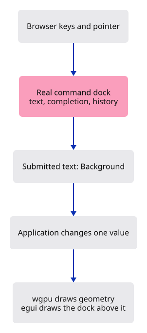

# Learn through our command line

**Every interactive checkpoint uses the viewer’s own Rust/egui command dock.** Type a command in the white field and press Enter. The lessons and browser checks use that route for features; picking and camera gestures still happen on the drawing.

The white canvas fills the browser window from lesson 01. The dock sits inside that canvas; lesson titles and explanations stay in these documentation pages.

Start with these lessons, in order:

| Lesson | What you understand afterward |
| --- | --- |
| [03a · Draw our command line](03a-panel.md) | Fonts, layout and the second GPU pass |
| [03b · Give it memory](03b-state.md) | Who owns text, suggestions and history |
| [03c · Draw completion and history](03c-layout.md) | How the production dock reads that state |
| [03d · Type into the dock](03d-input.md) | How browser keys become text and submitted lines |
| [04 · Change the picture](04-input.md) | How a submitted command changes application state |

Each page gives its typing estimate and complete source changes. The first three dock stages draw and organise the interface; keyboard input becomes usable in 03d. Some production layout code is long, so 03c needs several sittings. Its estimate includes that time.

## Follow one command

In lesson 04, type `Bac`. Completion suggests `Background`. Press Enter: the background changes while the triangle stays put. Submit `Background` again to return to white. The dock remembers both commands.



The dock helps you write a request and keeps the answer. The application receives the completed line and changes the relevant value. Renderer then paints the new state.

| Part | Owns |
| --- | --- |
| Browser adapter | Event translation, coordinates and focus |
| Command dock | Edited text, completion and history |
| Command vocabulary | Accepted words and options |
| Application or Editor | Camera and document changes |
| GPU painters | Geometry and interface drawing |

The dock, Noto fonts and styling are the production implementation. Early vocabulary such as `Background`, `Pan Right` and `Example Box` is for teaching. `Example Box` creates a fixed specimen; later lessons build the production Box command and its arguments. Type `Help` to see what the current checkpoint accepts.

## Review the working checkpoints

These local links require the course bundle server:

- [Type your first command](http://127.0.0.1:8781/03d-input/dist/).
- [Change the background](http://127.0.0.1:8781/04-input/dist/).
- [Use commands in the projection checkpoint](http://127.0.0.1:8781/25-projection/dist/).

The lesson pages include their own Chrome captures. [Release evidence](release.md) describes the exact checks and remaining limitations. The full viewer course continues according to the [complete lesson checklist](roadmap.md); these opening checkpoints do not yet contain all production features.

## Reproduce the checks

From `session_viewer`, build the displayed sources:

```sh
npm --prefix ../session_tests run course -- verify
npm --prefix ../session_tests run course -- serve 8781
```

In another terminal:

```sh
npm --prefix ../session_tests run course -- capture
```

The capture tool launches visible Chrome and types into the drawn egui field. It checks the build fingerprints first. It does not inject commands directly into Rust or use an HTML input substitute. These maintainer commands work under `target`; they do not write into your handwritten project.
