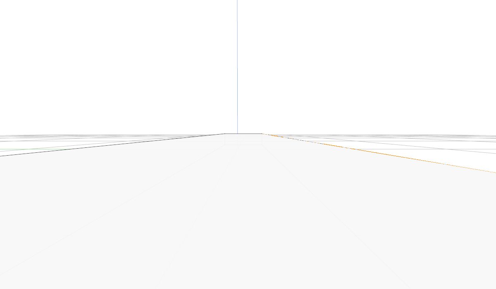
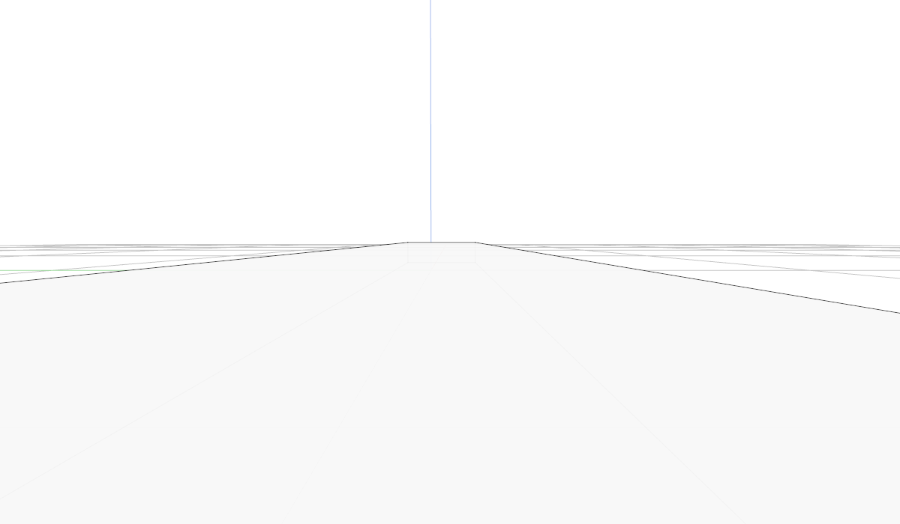

# Why close-up lines disappeared

The close-up plate reproduction failed on viewer commit `1cc94d21`: the CPU ray oracle found 7,609 visible edge samples, while the GPU inked only 5,959. The image marks the 1,650 missing samples in red or orange. The same view now inks all 7,609.





## Three related precision problems

A face crossing the near plane gains a clipped corner. Its clip depth is 1, but dividing by its very small `w` can put its screen coordinates millions of pixels outside the viewport. Fitting a depth plane from those divided points, then subtracting a large offset from depth 1, loses the small reverse-Z depth where the face actually appears. Its crease can consequently fail the hidden-line test against its own face.

`project_triangles.wgsl` now computes the depth plane directly from the original homogeneous corners `(x, y, w)`. The reference is the viewport centre. The existing clipped polygon still determines coverage, bounds and nearest depth, including its fourth edge when clipping produces a quadrilateral. The projected record remains 96 bytes; tile readers keep the same layout.

A clipped stroke endpoint can be equally far away. `ribbon.wgsl` now derives the screen line from its **original** clip endpoints and anchors it at the point nearest the viewport centre. Coverage measures short offsets from that anchor. Stroke depth uses endpoint-distance weights, avoiding a subtraction from the near endpoint's depth of 1.

Finally, a crease with zero geometric sag and its adjacent face take different float arithmetic paths. The visibility slack includes a placement-rounding allowance based on rebased position and eye distance, using the existing relative depth tolerance. It scales with the coordinates instead of imposing a fixed physical gap. Curved-edge sag is still honoured when it is larger.

## What the checks establish

The native oracle uses double-precision placed geometry. It casts perspective rays from the eye and parallel rays in orthographic views, independently of the shader's visibility calculation. The matrix covers 0.7°, 3° and 12° views, two eye heights, three window sizes, and MSAA 1 and 4. Decorations are disabled and faces are opaque, so grid lines and translucent back edges cannot masquerade as visible strokes. Hidden samples whose pixel neighbourhood overlaps a visible edge are excluded from the leak count.

The original close-up case retains the requested 0.95 opacity. The matrix checks full opacity too, where hiding mistakes are easiest to see. These cases verify box creases, not every possible curved surface, tiny gap, clipping-plane combination or GPU driver. The cumulative course will teach the calculations in its stroke and hidden-line chapters; this report records the production fix rather than claiming those chapters are finished.

Visible Chrome also checks 24 mouse-orbit/wheel-zoom views of a command-created box, at opacity 0.95 and 1.0. An independent CPU slab ray classifies its edges, and the screenshot supplies the ink. Every visible sample in these views was inked. The full native suite passes 498 tests, with 53 ignored; the release WebAssembly viewer builds.

Run from `session_viewer`:

```sh
buildslot env REGEN_PROTO=0 CARGO_BUILD_JOBS=4 CARGO_NET_OFFLINE=true cargo test --target x86_64-unknown-linux-gnu --lib selftest::oracle -- --nocapture --test-threads=1
```

`VIEWER_ORACLE_OUT=path.ppm` saves the marked native reproduction. The test skips with an explicit message if no GPU adapter is available; the reported results above used the available adapter and rendered actual frames.

With the release viewer served on port 8770, run `NODE_PATH=target/course-tools/node_modules node tests/close-up-lines.cjs` for the Chrome check. Its JSON evidence and screenshot are written under `target/course-checks/close-up-chrome.*`.

[Return to the complete tutorial checklist](roadmap.md).
