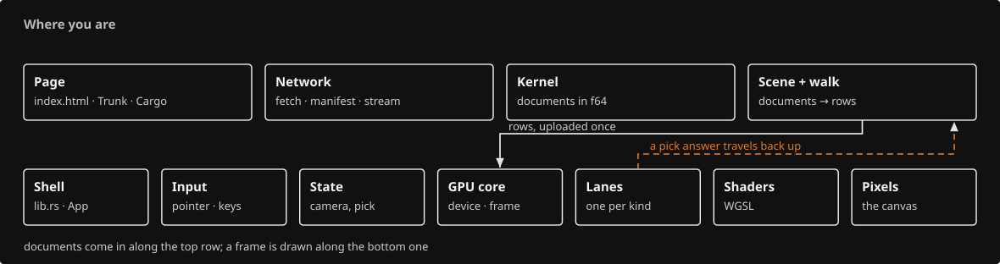

# The whole viewer and your place in it

This page describes the complete implementation reference. For the new smaller lessons and their availability, start with [the course route](journey.md).

You do not need to hold every function in your head. Start with three versions of the same object: its editable source, its display geometry, and the bytes the GPU draws. For any file, ask which version it owns and what it passes to the next part.

## Five jobs to keep in mind

| Part | What goes in | What comes out | Main responsibility |
| --- | --- | --- | --- |
| Loading | A manifest and file bytes | Validated source documents | Fetch, validate and stage a scene before publishing it. |
| Document and geometry kernel | Source objects and editing requests | Geometry, stable identities and transactions | Keep the editable truth and its undo history. |
| Display generation | Source geometry and identity | Triangles, strokes, markers, text and bounds | Make something efficient to draw while remembering its source. |
| GPU renderer | Display records, camera and view settings | Colour, depth and object-ID images | Turn records into visible pixels and information for picking. |
| Input, tools and interface | Gestures, commands and pick results | State changes and editing requests | Interpret what the user wants and ask the appropriate owner to act. |

Vue hosts this documentation. The viewer itself runs Rust compiled to WebAssembly, with WGSL shaders on the GPU. The geometry kernel is a dependency of the viewer; you do not rewrite that library in this course.

## Follow three small stories

**Open a box.** A manifest points to a file. The loader validates its contents. The scene retains the source object. A walker turns its geometry into display rows and preserves its identity. The renderer uploads those rows and draws them. File bytes have become a picture, but the original source still exists.

**Orbit around the box.** A pointer movement changes the camera. The next frame receives a different view-projection matrix. The original box vertices have not moved. Some screen-dependent work must be recomputed, but camera movement does not mean rebuilding the source model.

**Select and move the box.** Picking returns a displayed object ID. The scene maps it to the source box. A drag previews a placement; accepting the drag commits a document transaction. Display synchronization updates the affected rows. Undo reverses the source transaction and brings the display back into agreement.

These stories connect local code to the whole viewer. If you lose your place, return to the story your file serves and identify its input and output.

## Course milestones

| After this section | What you have | What is still ahead |
| --- | --- | --- |
| [00 · Browser startup](00-environment.md) | A Rust entry point that loads in the browser. | GPU drawing and interaction. |
| [01 · First frame](01-first-frame.md) | A GPU connection and a native offscreen image. | The browser event loop, scene startup and most geometry paths. |
| [09 · CAD display foundations](09-normals.md) | Camera, object rows, several drawing paths and the CAD-to-display contract. | Text, browser interaction and scene loading. |
| [14 · Loading scenes](14-loading.md) | A connected browser viewer that loads and presents the course scene. | Streaming, resource lifetimes, fuller presentation and editing. |
| [20 · Document history](20-history.md) | The connection between source transactions and displayed rows. | Direct-edit gestures and modeling tools. |
| [31 · Modeling and panels](31-splitting.md) | Editing, commands, tools, snapping, panels and splitting. | The remaining presentation controls and final integrated checks. |
| [37 · Finished viewer](37-command-dock.md) | The maintained viewer implementation and its verification examples. | Your own changes and deeper experiments. |

The course starts by building the lower-level drawing machinery, then connects the application around it. The order is not the same as the path a loaded file follows. A module may be built and tested before its browser caller arrives; each section says what can run at that stage.

## How to know you understand

Before typing, read the section’s purpose, data path and two or three suggested starting files. Then make a small sketch: **input → owner → operation → output**. Name the actual value or object at each end; “some data” is too vague to help you debug.

After a complete file, close the listing and explain one function to yourself. After the whole section, predict the result of its experiment before running it. A successful build checks the program; explaining why an input produces an output checks your understanding. Use the opening question and its answer at the end of the page to compare your reasoning.

For a long section, keep a four-line note between sittings: where I stopped; what this file owns; who uses its output; what I still cannot explain. At the next sitting, read that note before adding more code. Aim first to understand the responsibilities and connections. You can look up an API spelling when you need it.

If your explanation becomes unclear, return to the last value you can follow and work forward from there. There is no advantage in typing another ten files while the first connection is still a mystery.

## Time estimates

The hour ranges are **planning assumptions, not measured learner completion times**. They assume you have completed the earlier sections and include active reading, typing all comments and code, tracing examples, checking results and ordinary debugging. Installation, unattended downloads/builds, long interruptions and major environment problems are extra.

For a first plan, the generator allows roughly **80–160 listed lines per active study hour** for familiar patterns and **50–100** for sections with dense GPU, geometry, asynchronous or editing concepts. It adds 1–3 hours for orientation and experiments, or 2–4 for those deeper sections, then rounds the range. Review-only sections allow 1–3 hours. These are effective learning rates, not keyboard speeds; listed lines include comments and blank lines.

The large ranges are deliberate. Typing the entire implementation once makes some sections substantial projects. This course teaches far more than the minimum needed for a first wgpu program, and completing it is not a prerequisite for understanding the architecture above.

After your first two or three sittings, replace the default with your own pace. For example, if 120 listed lines took three active hours to type **and explain**, use about 40 lines per hour to budget similar remaining work, then allow time for the section’s final checks. Reading a familiar command pattern may be much faster than understanding a new shader. Revise the estimate rather than judging yourself against it.

Take breaks at sensible file boundaries. Only the completed section is a build checkpoint; an hour is a useful session length, not a promise that a large section will be finished.

[Find where each file is taught](file-map.md) · [Rust foundations](foundations.md) · [Start section 00](00-environment.md)

<!-- course-time-plan -->

## Section time plan

The 43 viewer sections total roughly **1,000–2,100 active study hours** under the assumptions above. Allow another **8–21 hours** for the Rust foundations. This is a substantial project; you can learn its overall structure well before finishing every file.

| Section | Estimated hours | What you are building or reviewing |
| --- | ---: | --- |
| [00 · Load Rust in the browser](00-environment.md) | 4–9 | Create the browser page and the Rust entry point. |
| [01 · First WebGPU frame](01-first-frame.md) | 65–125 | Connect the GPU, allocate its shared resources and draw the first offscreen frame. |
| [02 · Camera](02-camera.md) | 15–25 | Implement orbit, pan and zoom, and turn a camera into a projection. |
| [03 · Object rows and identity](03-identity.md) | 3–6 | Give displayed objects stable rows, placement and identity. |
| [04a · Meshes on the GPU](04a-meshes.md) | 45–90 | Pack meshes into shared GPU storage and draw indexed triangles. |
| [04b · Strokes and arrows](04b-strokes.md) | 35–70 | Draw readable strokes and arrows with width and visibility rules. |
| [04c · Markers](04c-markers.md) | 7–15 | Render points and control markers with identifiable owners. |
| [04d · Point clouds](04d-clouds.md) | 20–40 | Organize point clouds and draw the detail needed for the current view. |
| [05 · Depth and visible ink](05-visibility.md) | 1–3 | Trace how surfaces decide whether nearby ink is visible. |
| [06 · CAD face rules](06-cad-contract.md) | 50–95 | Translate editable CAD geometry into display records with source identity. |
| [07 · Shared boundaries](07-boundaries.md) | 1–3 | Follow the sampling and ordering of a shared CAD boundary. |
| [08 · Trims, holes and periodic seams](08-trimming.md) | 1–3 | Trace trims and holes from surface coordinates to displayed faces. |
| [09 · Normals and shading](09-normals.md) | 1–3 | Check face winding and the normals used for shading. |
| [10 · Text shaping](10-text-layout.md) | 5–15 | Turn text into shaped glyph runs and measured positions. |
| [11 · Text rendering](11-text-rendering.md) | 35–65 | Render shaped text, its coverage and its placement in the scene. |
| [12 · The viewer shell and picking](12-picking.md) | 55–110 | Connect browser events, redraw requests and asynchronous picking. |
| [13 · Source controls and cloud picks](13-controls.md) | 2–5 | Connect control selection and cloud picks to original source identities. |
| [14 · Loading scenes](14-loading.md) | 45–90 | Load a scene description and publish its geometry to the viewer. |
| [15 · Publication and streamed reads](15-publication.md) | 35–65 | Read large published files through metadata and selected byte ranges. |
| [16 · Resource accounting and release](16-accounting.md) | 75–150 | Track shared CPU/GPU allocations and release resources at the right time. |
| [17 · Source faces, text objects and one silhouette](17-source-presentation.md) | 30–60 | Present selected source faces, labels and a consistent silhouette. |
| [18 · Finite-triangle visibility](18-finite-visibility.md) | 15–25 | Build screen-tile lists for precise triangle visibility tests. |
| [18a · Instancing](18a-instancing.md) | 3–6 | Prepare shared geometry for drawing at multiple placements. |
| [18b · Clipping planes and section caps](18b-clipping.md) | 30–55 | Apply clipping planes and draw the cut surfaces of eligible solids. |
| [19 · Sheets: batched drawings with lazy metadata](19-sheets.md) | 15–30 | Draw batched sheets while looking up detailed entity information on demand. |
| [20 · The document and its rows](20-history.md) | 25–50 | Connect document transactions, undo/redo and display synchronization. |
| [21 · Direct editing](21-editing.md) | 115–230 | Implement direct editing, previews, cancellation and final commits. |
| [22 · The egui layer](22-runtime-helpers.md) | 7–15 | Draw the egui interface above the scene and manage its resources. |
| [23 · The command line: one verb per file](23-geometry-commands.md) | 45–85 | Connect command words and options to application actions. |
| [23a · Tools that ask for points](23a-tools.md) | 85–165 | Build interactive tools that ask for a sequence of points or choices. |
| [23b · Shapes](23b-shapes.md) | 20–35 | Construct shapes from the dimensions and frame collected by a tool. |
| [23c · Surfacing](23c-surfacing.md) | 30–60 | Turn selected curves and surfacing choices into new surface geometry. |
| [23d · Annotate and measure](23d-annotate-measure.md) | 15–30 | Measure geometry and display the resulting annotations. |
| [24 · Snapping](24-placed-controls.md) | 2–5 | Connect the Snap command to the snapping system introduced during direct editing. |
| [25 · Draw a solid, readable gumball](25-gumball.md) | 6–15 | Render identifiable gumball handles with a clear on-screen shape. |
| [26 · The nested session panel](26-nested-panel.md) | 5–15 | Represent a nested scene as expandable panel rows. |
| [30 · The layers panel and the layer tree](30-layer-tree.md) | 20–35 | Apply layer visibility and selection through shared source identities. |
| [31 · Split curves and faces](31-splitting.md) | 20–40 | Connect splitting tools, cutters and the resulting geometry edits. |
| [32 · Ambient occlusion](32-colors-lighting.md) | 35–65 | Estimate ambient occlusion using depth data and a depth pyramid. |
| [33 · GTAO, Arctic and Outline](33-contact-shadows.md) | 3–7 | Connect Arctic, outline and contact-shading controls to render state. |
| [35 · Element features](35-attributes.md) | 3–6 | Show or hide element features through the shared display state. |
| [36 · Translucent faces and Opacity](36-translucent-faces.md) | 2–5 | Expose face opacity through the command and state layers. |
| [37 · Self-test: the finished viewer](37-command-dock.md) | 15–30 | Exercise the finished viewer from a scene file through GPU output. |
