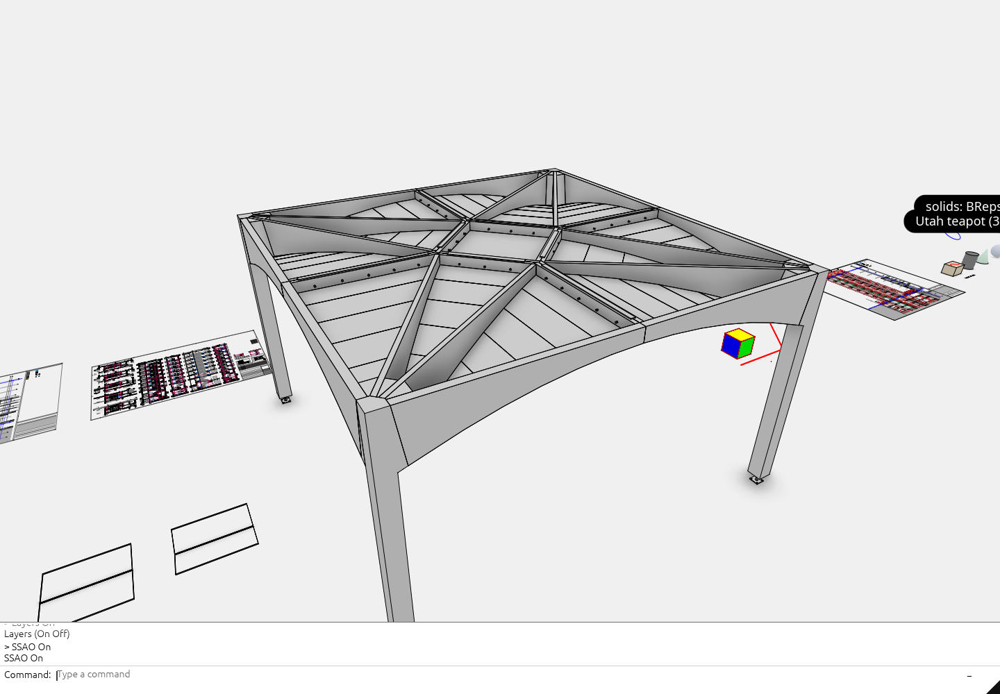
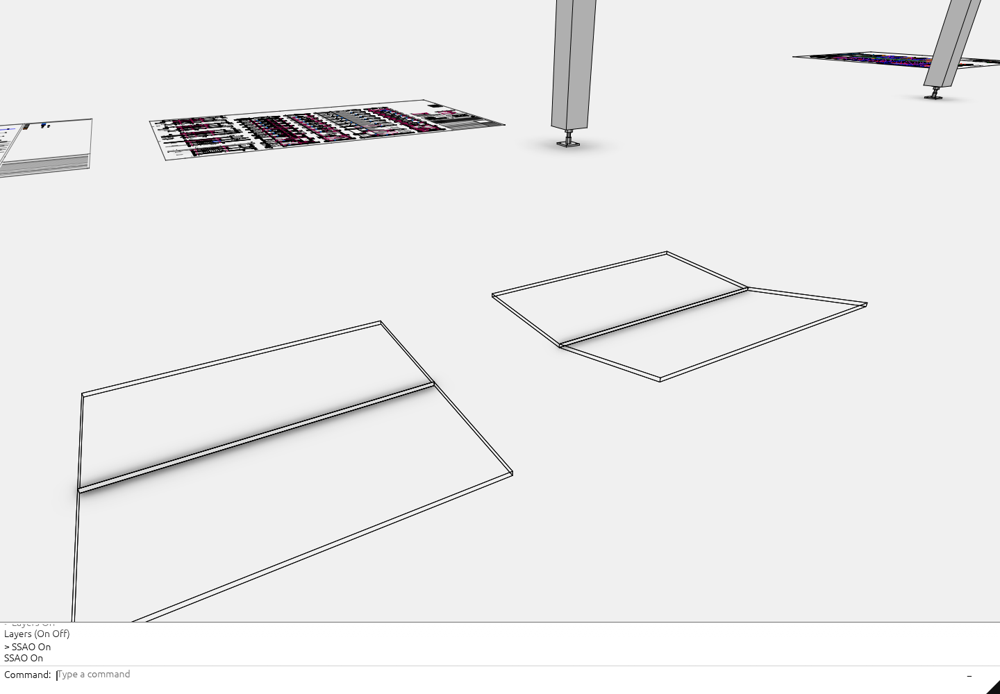

# Arctic lighting and contact shadows

Type `Arctic`, press **Enter**, then choose **On** or **Off**. `Arctic On` and `Arctic Off` also run directly. **G** toggles the same lighting when the viewport has keyboard focus. The `SSAO` command has been removed. Arctic starts off and preserves the camera when toggled.

Arctic keeps authored colors under neutral sky and ground lighting, with soft contact shadows on surfaces and a virtual floor beneath the lowest visible solid. Hidden objects, sheets and point clouds do not lower that floor. This screen-space approximation cannot include hidden or off-screen occluders.

## Navigation

The same occlusion calculation runs during orbit, pan, zoom and stationary redraws. Drag tiers never disable it or lower its resolution. Arctic also suppresses the automatic canvas-scale/MSAA downgrade after sustained slow frames. While the camera moves, the filter reprojects the previous shading onto the same surface points to reduce sampling shimmer. Depth and surface-type checks reject newly exposed geometry, and neighborhood clamping bounds reused shading. Geometry edits, toggles and resizes discard history. Releasing a drag holds the last image without a quality transition or additional settling frames; a stationary camera reuses it.

Surface occlusion runs at `clamp(1 / DPR, 0.25, 0.5)` times the canvas dimensions. On high-DPI phones this approaches CSS-pixel resolution. The broad ground-shadow field uses half that resolution with more horizon samples, then interpolates into the surface pass. These resolutions remain fixed throughout navigation.

## Rendering

- Four cosine-weighted horizon slices estimate surface visibility from a linear-depth pyramid. Triangle normals remain faceted.
- Ground contacts use twenty-four directions and six steps, with the original height and distance fades. They retain each object's contact radius.
- The depth pyramid carries the original sampled pixel coordinates alongside a compact radius, so coarser levels reconstruct the actual occluder position.
- Separable bilateral filtering, motion reprojection and depth-aware reconstruction produce a full-resolution R8 shading cache. Reconstruction follows the actual depth-sample centers to prevent subpixel drift.
- At 4× MSAA, the cache stores the least occlusion among the pixel's samples. A cached correction buffer shades the other samples only in affected screen tiles. Both blends happen before MSAA resolve.
- Browser pipelines compile after geometry appears, in idle callbacks or a deferred callback on browsers without that API. The 1× and 4× pipelines survive toggles and resizes. Camera movement creates no AO textures, bind groups or pipelines.

The horizon integral follows [Jimenez et al., Practical Real-Time Strategies for Accurate Indirect Occlusion](https://www.activision.com/cdn/research/Practical_Real_Time_Strategies_for_Accurate_Indirect_Occlusion_NEW%20VERSION_COLOR.pdf); [Intel's XeGTAO](https://github.com/GameTechDev/XeGTAO) provides a reference implementation. This implementation combines deterministic samples and spatial filtering with motion reprojection; it does not require a separate temporal-antialiasing pass.

## Memory

At **1920×1080, DPR 1**, AO textures reserve **7,905,780 bytes** (7.91 MB): a six-level R32 depth/R16 metadata pyramid, two half-resolution R8 working images, quarter-resolution ground and history-depth images, a coarse occupancy mask and the full-resolution R8 cache. Resource estimates exclude driver alignment and internal allocations.

AO buffers add **348 bytes at 1×**, or **8,360,016 bytes at 4×**. The latter includes per-pixel sample corrections and tile indices for the cached MSAA blend. Turning Arctic off releases these textures and buffers; compiled pipelines remain available.

Faceted normals and contact radii come from the existing vertex, index, owner and instance buffers. Arctic neither allocates nor projects the large triangle table; picking and stroke visibility still use it when needed. The dragon fixture uses **25.48 MB of total GPU buffers at 1× / 33.84 MB at 4×**, below the 40 MB target.

## Measurements

Native GPU timestamp medians on the dragon at 1920×1080, DPR 1, **baseline → current**, in milliseconds. The local `petras` laptop has an Intel i9-13900HX with Raptor Lake-S UHD graphics and an NVIDIA RTX 4080 Laptop. These measurements do not establish performance on the separate work laptop.

| GPU | MSAA | Cached AO | Moved AO | Drag AO |
| --- | ---: | ---: | ---: | ---: |
| Intel Raptor Lake-S UHD | 1× | 0.345 → 0.217 | 26.593 → 5.146 | 11.720 → 5.199 |
| Intel Raptor Lake-S UHD | 4× | 10.934 → 1.976 | 45.055 → 11.500 | 17.671 → 11.577 |
| NVIDIA RTX 4080 Laptop | 1× | 0.020 → 0.014 | 1.113 → 0.467 | 0.449 → 0.456 |
| NVIDIA RTX 4080 Laptop | 4× | 0.292 → 0.042 | 1.812 → 0.607 | 0.640 → 0.499 |

Intel 4× moving AO measures 11.500 ms moved / 11.577 ms drag. The 6 ms target remains unmet. Intel 1× moving AO is 5.146 ms moved / 5.199 ms drag against the 4 ms goal; that target also remains unmet. Intel whole GPU frames during drag: 1× 14.271 ms; 4× 21.822 ms. Timings measure GPU work, not browser input latency. The full effect includes depth preparation, ground shadows, filtering, history validation, MSAA reconstruction and compositing; it costs more than the GTAO horizon pass alone. The bunny also has an expensive existing edge-rendering pass independent of Arctic.

In a controlled native rotation regression, ground sampling and reprojection reduce variation at fixed ground points by about **54%** versus the spatial draft, retaining approximately **97%** of mean shadow strength. In a 32-frame browser capture of `view_live`, the denser ground sampling reduces variation by another **16%** over reprojection alone, with essentially unchanged shadow strength. Some view dependence remains because this is a screen-space approximation. Native validation passes 276 library tests; the AO GPU suite, browser contact/rotation checks and 42 published-scene configurations pass. Phone viewport checks use the desktop GPU.

## Check the look

Open `/view_mixed`, run `Layers On`, select the floor-model group and run **Fit**. Clear selection with **Escape**, hide the panel with `Layers Off`, and compare `Arctic On` / `Arctic Off` at the column bases. Repeat with plates/contact and solids/BReps to inspect creases, the cone and the torus. Camera framing must remain identical.

Baseline references:

`tests/ambient-details.cjs` checks primitive shadows and plate smoothness. `tests/ambient-floor.cjs` checks the full floor scene, late loading and unchanged camera framing. `tests/ambient-lighting.cjs` checks real WebGPU, memory release and controls; `AMBIENT_SPIN=1` exercises continuous rotation. Native tests cover both projections, 1×/4× MSAA, contact halos, unchanged images through drag tiers, immediate history rejection after geometry changes, and pipeline reuse across twenty toggles and twenty resizes. A rotation regression measures shadow variation at fixed world-space ground points and checks that smoothing retains contact strength.

The local default manifest cannot be checked because its five referenced `.pb` fixtures are missing. Published scenes provide the browser regression fixtures.

Review captures and benchmark reports for this checkout are under `target/review/arctic/`; `before/` preserves the original executable, browser bundle and captures.
