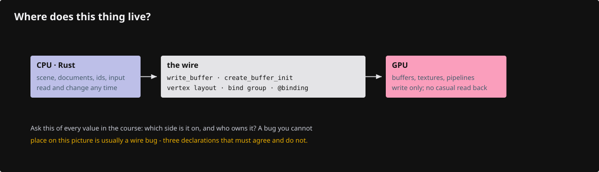

# Words before code

Every word the lessons use before they have room to explain it, with the lesson that first needs it. Each entry names the file or call where the thing appears.

## Two sides and a wire

- **CPU side**: your Rust structs, the kernel documents, the scene, input events, object ids. You can read and change them at any time.
- **GPU side**: buffers, textures, bind groups, pipelines, shaders. You cannot read them back casually; you *send* bytes and commands.
- **The wire**: `queue.write_buffer`, `create_buffer_init`, the vertex layout, the bind-group layout, the shader's `@location`/`@binding` declarations. 
- Ask of every object: *CPU or GPU? Made once or every frame? Who owns it?* The answers are the architecture.

## Made once (lesson 01)

- **instance** — the entry to WebGPU, made from nothing (`wgpu::Instance::new`). It finds adapters and makes surfaces. `Backends::BROWSER_WEBGPU` means the browser's WebGPU only.
- **adapter** — one GPU as the browser offers it. You ask for one that can draw to your canvas (`compatible_surface`); nothing is drawn through it.
- **device** — your open connection to that GPU. Every buffer, texture, shader and pipeline is created through it.
- **queue** — the device's inbox: `write_buffer` and `submit` go there, and the GPU runs them in order.
- **surface** — the canvas as wgpu sees it. Each frame it hands out one texture to draw into (`get_current_texture`); `present` hands it back to the browser to show.
- **surface configuration** — what textures the surface hands out: pixel format, size in physical pixels, present mode. Redone on resize (`surface.configure`), never per frame.

## Memory (01, 03, 04a)

- **buffer** — bytes on the GPU with fixed *usages* chosen at creation: `UNIFORM` (a small block every invocation reads), `STORAGE` (a big array a shader indexes), `VERTEX` / `INDEX` (what a draw pulls), `COPY_DST` (the CPU may write into it later), `COPY_SRC` (the GPU may copy out of it). Using a buffer a way it was not created for is a validation error, at the call, not at creation.
- **uniform buffer** (01) — the camera matrix: 64 bytes, same for every vertex.
- **storage buffer** (03) — `array<Instance>`: one row per object, any length, indexed by the shader.
- **vertex buffer / index buffer** (04a) — fixed-size vertex records, and triangle corner numbers three per triangle so a shared corner is stored once (`draw_indexed`).
- **texture** — a grid of texels with a format: the surface's colour format; `Depth32Float` (04a, one depth per pixel); `Rg16Float` (05, the depth-gradient target; lesson 18 widens it to `Rgba16Float` to carry a triangle address too); `Rg32Uint` (12, pick ids); `R8Unorm` (17, coverage masks).
- **texture view** — the handle a pass draws into or a bind group reads. Passes attach views, not textures.
- **attachment** — a view a render pass writes: the colour attachment gets fragment colours, the depth attachment remembers the nearest depth per pixel.
- **multisampling (MSAA)** (04a, used from 05) — N colour and depth samples per pixel so a partly covered edge pixel gets a partial colour; pipelines and every attachment of a pass must share the sample count; the samples are *resolved* into the 1-sample surface at the end.

## Binding (01, 03, 04a)

- **bind group layout** — the *shape* of a set of resources: group N has binding 0 of this kind, binding 1 of that kind, visible to these stages. A pipeline is compiled against shapes.
- **bind group** — the *filled* set: this buffer at binding 0, this view at binding 2. Plugged in at draw time with `set_bind_group`.
- **`@group(g) @binding(b)`** — the shader's name for one slot; it must agree with the layout and with what the bind group holds.
- **the scene contract** (04a onward, `src/shaders/scene.wgsl`) — group 0 the camera matrix, group 1 the per-frame line block, group 2 object rows and translations (plus the physical depth for ink), group 3 the lane's own. Every lane shader is compiled with that file appended (`pipelines::scene_module`).
- **shader stage visibility** — each layout entry lists the stages allowed to read it; a stage reading a binding it may not see fails at pipeline creation.

## Pipeline (01, 04a)

- **render pipeline** — the frozen recipe for one kind of draw: which shaders, what vertex input, what output formats, blending, depth rule, sample count. Validated once, so every draw is cheap; rebuilt only when the sample count flips (`Gpu::retarget`).
- **pipeline layout** — the list of bind-group layouts the pipeline expects, in group order.
- **entry point** — the shader function a stage runs (`vs_main`, `fs_main`). One module can hold several; `PipelineDesc::with` and `vertex` pick them.
- **`PipelineDesc`, `build`** (04a, `src/engine/pipelines/mod.rs`) — the house form: one base per shader, variants by fragment entry, colour mode and depth mode; `build` is the only place a pipeline is created.
- **depth mode** — every compare is reverse-Z: nearer is **greater**. `Opaque` writes and tests, `ReadOnly`/`ReadOnlyEqual` test only, `Always` neither, `Detached` has no depth attachment at all.
- **colour mode** — `Opaque` overwrites, `Blended` mixes by alpha, `Max` keeps the larger value (coverage masks), `Nothing` writes no colour (a pass run for its side effects).
- **pipeline-overridable constant** (`override SCENE_MSAA`, 04b) — a shader constant the Rust side sets at build time, so one WGSL source gives a 1x and a 4x variant.

## A frame (01)

1. The browser asks for a frame (`RedrawRequested`); the app decides whether anything changed (`needs_frame`).
2. `surface.get_current_texture()` gives this frame's texture; `create_view` gives the handle to draw into.
3. `device.create_command_encoder()` starts an empty command list.
4. `encoder.begin_render_pass(...)` opens a section aimed at given attachments; `LoadOp` says clear or keep, `StoreOp` says keep or drop.
5. `set_pipeline`, `set_bind_group`, `set_vertex_buffer`, `draw` / `draw_indexed` record work; nothing runs yet.
6. The pass ends when it goes out of scope (the inner braces); `encoder.finish()` closes the list into a command buffer.
7. `queue.submit` hands the list to the GPU; `present` shows the texture.

- **vertex stage** — runs `vs_main` once per vertex, must return a clip-space position; `@builtin(vertex_index)` and `@builtin(instance_index)` are the two counters a draw hands it.
- **rasterizer** — finds every pixel inside the triangle and blends the vertex outputs across it (interpolation). `@interpolate(flat)` takes one vertex's value unchanged: ids and flags must be flat.
- **fragment stage** — runs `fs_main` once per covered pixel (or per sample with `@builtin(sample_index)`); returns the colour for `@location(0)`; `discard` throws the fragment away, writing neither colour nor depth.
- **clip space** — what the vertex stage outputs: (x, y, z, w). After the divide by w, x and y in −1..1 are on screen and z in 0..1 is the depth; a vertex parked at (3, 3, 0.5, 1) is outside and its triangle vanishes (`dead_vertex`).

## Coordinates (02)

`local (f64, kernel millimetres) → world (placement) → view (eye at the origin, −Z ahead) → clip → NDC (÷ w) → pixels`

- **model / view / projection** — placement of one object; the camera's own transform; perspective (divides by distance, converging lines) or orthographic (no divide, parallel lines stay parallel, what a CAD drawing is).
- **near and far planes, frustum, field of view** — only what lies between near and far is drawn; the frustum is the cut pyramid the screen sees; the vertical field of view is its opening angle.
- **reverse-Z** — depth 1 at the near plane, 0 at the far plane, clear value 0, compare `Greater`. It spends float precision where CAD needs it: near the eye.
- **anchor / rebase** (02, 04a) — the camera works in f64; the GPU rows are f32. Positions are stored relative to an *anchor* near the camera target and the anchor moves when the camera drifts far, so nothing jitters kilometres from the origin.
- **CSS pixel vs physical pixel** — page layout counts CSS pixels; a HiDPI screen has 2 (or 1.5, 3) physical pixels per CSS pixel: `devicePixelRatio`. The canvas draws in physical pixels; pens and markers are sized in CSS pixels and scaled.
- **aspect ratio** — width over height of the framebuffer; the projection needs it so a circle stays a circle.

## Shader words (01-04)

- **WGSL** — the WebGPU Shading Language: small, C-like, no pointers, run in parallel per vertex or per fragment.
- **`let` / `var`** — immutable value / mutable variable. A `var` without an initializer is zero.
- **`vec3<f32>`, `vec4<f32>`, `mat4x4<f32>`** — vectors and a 4×4 matrix; `m * vec4(p, 1.0)` moves a point, the trailing 1.0 is what makes it a point rather than a direction.
- **swizzle** — `.xyz` / `.rgb` picks components; `.xy` of a position is the pixel.
- **`select(f, t, cond)`** — the false value comes **first**: `select(a, b, c)` is `c ? b : a`.
- **`mix(a, b, t)`** — `a + (b − a) · t`.
- **`textureLoad`** — one texel at integer coordinates, no filtering.
- **`@builtin(position)`** — in the vertex stage the clip position you output; in the fragment stage the pixel centre in framebuffer pixels plus depth.
- **alignment** (03) — a `vec4` and each matrix column start on 16 bytes, a `vec3` too although it is 12 bytes wide, and a struct in an array is padded to its largest alignment: the `Instance` row is 96 bytes because of this, and `_pad` fields on the Rust side make the two agree.

## House words

- **row / instance** (03) — one object on the GPU: a 96-byte record (`Instance`: model matrix, colour, flags, spacing). A pick returns a row; `Scene` turns it into a source identity.
- **lane** (04a) — one drawing family with its own buffers, pipelines and draw calls: `arena` (meshes), `segments` (strokes), `glyphs` (markers), `cloud` + `splat` (points), `text`, `surface_outline`. Lanes do not reach into each other's buffers, except where one lane owns another outright — the arena owns the outline-text lane and the tile pool. `Gpu` lists them by hand.
- **upload** (04a) — the typed rows one file produces, with no wgpu types in them; `Gpu::set_scene` appends them to the lanes, then the rows are dropped.
- **walk / producer** (06) — the CPU code that turns one kernel geometry into rows; one producer per geometry family in `src/app/walk/`.
- **face pass / physical** (04a, 05) — the first pass: solid faces write colour, depth and a depth-gradient. "Physical" means *this is what occludes*.
- **ink** (04b) — everything that is not a solid face: strokes, markers, lettering, drawn in the second pass, which reads the physical depth and decides visibility per fragment (`ink_visibility.wgsl`).
- **pcurve** (07) — a *parameter curve*: a trimmed face's boundary in the surface's own `u`,`v` domain, not in XYZ. Lifting it through the surface gives the 3D edge; mapping a shared XYZ edge back onto each face's pcurve is how two faces agree where it lies.
- **grid face / constrained face** (07) — which mesher produced a face. A *grid* face comes from `mesh_q`, sampling the whole `u`,`v` rectangle on a regular grid, so its boundary is an iso line read straight off the `u`/`v` attributes. A *constrained* face comes from `mesh_loops`, triangulating inside given trim loops, so its boundary nodes carry `brep_edge/{edge}/{use}/{sample}` tags. 
- **constrained Delaunay** (07) — a triangulation that is Delaunay except that named segments are forced to appear as edges. Here the forced segments are the trim loops, which is what makes a boundary node a mesh node rather than an approximation of one.
- **source vs display** — source: the kernel's face, edge, control point, in f64, with its id. Display: the triangles, node chains and markers made from it. GPU: the packed rows. Selection always names a source thing.
- **id pass / pick window** (12) — the same draws again into an integer target, only in a small window around the cursor, read back asynchronously; the answer is a row plus a sub-id.
- **coverage mask / silhouette** (17) — an `R8Unorm` texture marking which pixels a solid (and its edges) covers; a compositor darkens the ring just outside it. `O` toggles it.
- **x-ray** (`P`) — every multi-face solid loses its faces (they are discarded in all entry points), so only edges, vertices and text remain; single faces keep their shading; no silhouettes while it is on.
- **headlight** (`D`) — the camera light on shaded faces; off by default, so a face shows its flat colour.
- **tile lists / finite visibility** (18) — projected triangles binned into screen tiles, so an edge is hidden only by triangles that actually cover it, not by a neighbour's extended plane.
- **CSR** (06) — compressed sparse row: one flat array of entries plus a per-owner start index, instead of a vector per owner. The vertex→edge incidence is stored this way (`vstart`, `vinc`), so a vertex finds its edges without a heap allocation each.
- **generation** (12, 13) — a counter on every asynchronous answer (pick, range read); an answer from an older generation is dropped when it lands.

## Rust idioms the code leans on

- **`#[repr(C)]` + `bytemuck::Pod`** (03) — lay the fields out in order with C's padding, and promise there are no pointers and no padding bytes, so `cast_slice` can view the struct as `&[u8]` for the GPU without copying.
- **`Rc<Session>` / `Weak`** (12, 16) — a document shared by the scene and whoever decoded it, counted not copied; a `Weak` remembers it without keeping it alive.
- **`Arc` on the error callback** (01) — the device keeps the handler and calls it later, so it takes shared ownership.
- **`anyhow::Result`, `?`, `ensure!`, `bail!`** (01) — one catch-all error type; `?` converts, `ensure!` checks, `bail!` returns early.
- **`#[cfg(target_arch = "wasm32")]`** — code that exists only in the browser build; the crate's default target is wasm32, tests run natively through `cargo xtest`.
- **let-else / let chains** (06) — `let Some(x) = y else { continue }` and `if let A = b && cond { }`: edition 2024 forms the kernel code uses.
- **`OnceLock` knobs** (06, `src/app/knobs.rs`) — a query-string or environment switch read once per process. The view knobs arrive earlier, in `src/engine/gpu/view.rs` (04a).

## Questions and answers

**Which of these is made per pipeline and which per buffer: a bind group layout, a bind group?**

*How to work it out.* A layout names *kinds* of resources at slots — the shape the shader was compiled against; a bind group names *actual* buffers and views. A pipeline is compiled once; the buffers it draws from change.

*The answer.* The layout is compiled into the pipeline; the bind group is made per set of real resources and plugged in at draw time. One pipeline draws with many bind groups.

**With reverse-Z, the depth buffer is cleared to 0 and faces compare `Greater`. What happens if the clear value were 1?**

*How to work it out.* Depth after the divide lies in 0..1, so the largest value any fragment can have is 1. Ask whether `1 > 1` is ever true.

*The answer.* Nothing passes, ever: the canvas keeps its clear colour. This is the failure behind a black canvas when the depth convention is only half changed.

**A vertex shader outputs `(3.0, 3.0, 0.5, 1.0)` for all three vertices. What reaches the fragment stage?**

*How to work it out.* Divide by w: x = y = 3, outside the −1..1 the screen covers. All three vertices are outside the same side of the volume, so the whole triangle is clipped.

*The answer.* Nothing — no fragment entry runs. That is exactly how `dead_vertex` makes a hidden row disappear from the colour pass and the id pass at once, with one branch in the vertex stage.

**Name the three things Rust and WGSL must agree on for one draw, and where each mismatch shows up.**

*How to work it out.* Walk the pipeline descriptor field by field and ask which ones restate something the shader also declares.

*The answer.* Group and binding numbers, the entry-point names, and the colour target format. All three surface as a validation error when the pipeline is created, never as a Rust compile error — `cargo check` cannot see inside WGSL, which is why `cargo xtest` parses every shader with naga.

**Where does the source identity of a face live: on the GPU, in `Scene`, or in the kernel?**

*How to work it out.* Ask what each layer holds. The GPU has a row index and a face address — numbers. `Scene` has the mapping and the retained documents. The kernel `Session` has the face itself, with its guid.

*The answer.* In the kernel, retained by `Scene` through `Rc`; the GPU knows only an object row and a face address, `Faces::source` turns that pair into the face it came from, and `Scene::resolve` turns the row into its document and guid. That is why picking never reads a vertex buffer back from the GPU.
